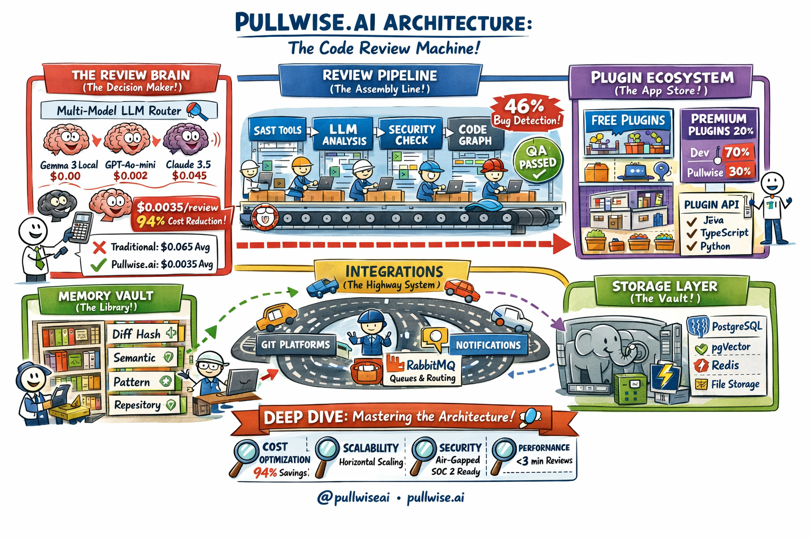

# Pullwise - The Open Code Review Platform

<div align="center">

  

  **The Open Code Review Platform**

  [](https://opensource.org/licenses/MIT)
  [](https://github.com/integralltech/pullwise-ai/actions)
  [](https://github.com/integralltech/pullwise-ai)

  [Website](https://pullwise.ai) • [Docs](https://docs.pullwise.ai) • [Demo](https://pullwise.ai/demo) • [Discord](https://discord.gg/pullwise)

  **Production-Grade. Free Forever. MIT Licensed.**

</div>

---

## What is Pullwise?

Pullwise is an **open-source, self-hosted AI code review platform** that combines static analysis (SAST) with large language models (LLMs) to provide intelligent, automated code reviews.

### The Problem

Code reviews are essential for software quality, but they're:
- **Time-consuming** — Senior developers spend hours reviewing PRs
- **Inconsistent** — Different reviewers catch different issues
- **Expensive** — Enterprise tools cost thousands per month
- **Vendor lock-in** — Proprietary solutions trap your data

### The Solution

**Pullwise Community Edition (MIT Licensed):**
- **Free forever** — No credit card, no time limits
- **Self-hosted** — Your code never leaves your infrastructure
- **AI-Powered** — Multi-model LLM support (Claude, GPT-4, local models via Ollama)
- **SAST Integration** — SonarQube, ESLint, Checkstyle, PMD, SpotBugs
- **Multi-Platform** — GitHub, GitLab, BitBucket, Azure DevOps
- **Auto-Fix** — One-click apply AI suggestions
- **IDE Support** — VS Code extension and IntelliJ IDEA plugin
- **CLI** — Full-featured command-line interface (`pullwise` / `pw`)

---

## Quick Start

### Docker Compose (recommended)

```bash
# Clone the repository
git clone https://github.com/integralltech/pullwise-ai.git
cd pullwise-ai

# Start all services
docker-compose up -d

# Access Pullwise
# Frontend: http://localhost:3000
# Backend API: http://localhost:8080
```

This starts PostgreSQL (with pgvector), Redis, RabbitMQ, the backend, and the frontend.

To include monitoring (Prometheus, Grafana, Jaeger):

```bash
docker-compose --profile monitoring up -d
# Grafana: http://localhost:3001
# Prometheus: http://localhost:9090
# Jaeger: http://localhost:16686
```

### System Requirements

- **Docker** 20.10+ and Docker Compose 2.0+
- **4 GB RAM** minimum (8 GB recommended with monitoring)
- **10 GB** disk space
- **Linux**, **macOS**, or **Windows** with WSL2

---

## Architecture



**Backend:** Java 17, Spring Boot 3.2, PostgreSQL 16 (pgvector), Redis, RabbitMQ

**Frontend:** React 18, TypeScript, Vite, Mantine UI, TanStack Query

**CLI:** Node.js, Commander.js — `npm install -g @pullwise/cli`

**IDE Extensions:** VS Code (.vsix) and IntelliJ IDEA plugin

---

## Key Features

### Hybrid SAST + AI Reviews

Pullwise combines static analysis with AI in a multi-pass pipeline:

1. **Static Analysis** (parallel execution):
   - SonarQube (bugs, vulnerabilities, code smells)
   - ESLint (JavaScript/TypeScript)
   - Checkstyle, PMD, SpotBugs (Java)

2. **AI Review** (with full context):
   - SAST results as baseline
   - Code graph analysis (dependency-aware)
   - RAG with project knowledge base (pgvector)
   - Custom team instructions

3. **Smart Consolidation**:
   - Deduplicates similar issues
   - Prioritizes by severity and risk
   - Formats actionable inline comments

### Multi-Model LLM Router

- **Cloud models**: Claude, GPT-4, Gemini Pro via OpenRouter
- **Local models**: Llama 3, Mistral, Gemma via Ollama
- **Routing strategies**: `cost-optimized`, `quality-first`, `balanced`
- **Fallback**: Graceful degradation when models are unavailable

### Multi-Platform Support

| Platform | Webhooks | PR Comments | Status Checks |
|----------|----------|-------------|---------------|
| GitHub | Yes | Yes | Yes |
| GitLab | Yes | Yes | Yes |
| BitBucket | Yes | Yes | Yes |
| Azure DevOps | Yes | Yes | Yes |

### Auto-Fix

- AI-generated fix suggestions with confidence scoring
- Safe preview with code diff before applying
- Batch operations for multiple issues
- Rollback support

### Plugin System

Extensible via SPI-based plugin architecture:
- Language linters (Rust, Go, Python, PHP)
- Framework-specific rules (Laravel, Django, Spring)
- Custom checks for your codebase

### CLI

```bash
npm install -g @pullwise/cli

pw auth login                    # Authenticate
pw projects list                 # List projects
pw reviews trigger 42            # Trigger review for PR #42
pw reviews watch 123             # Watch review in real-time
pw review --staged               # Review staged changes locally
pw hooks install                 # Install git hooks
```

### IDE Extensions

- **VS Code**: Inline diagnostics, trigger reviews, view issues, status bar integration
- **IntelliJ IDEA**: External annotator, review actions, settings panel, status bar widget

---

## Editions

Pullwise follows an **open-core model**:

| Feature | Community Edition | Professional | Enterprise |
|---------|------------------|-------------|------------|
| **Price** | **FREE** | $49/dev/mo | $99/dev/mo |
| **License** | MIT | Proprietary | Proprietary |
| **Users** | 5 | 50 | Unlimited |
| **Organizations** | 1 | 3 | Unlimited |
| **Review Pipeline** | 2-pass | 4-pass | 4-pass |
| **Code Graph** | -- | Yes | Yes |
| **SSO/SAML** | -- | Yes | Yes |
| **Audit Logs** | -- | 30 days | 1 year |
| **SLA** | Community | 48h | 4h |

---

## Development

### Backend (Java 17 + Spring Boot 3.2 + Maven)

```bash
cd backend
./mvnw spring-boot:run -Dspring-boot.run.profiles=dev    # Dev server (port 8080)
mvn test -B                                                # Run all tests
mvn test -Dtest=ClassName#methodName                       # Run single test
```

### Frontend (React 18 + TypeScript + Vite)

```bash
cd frontend
npm ci --legacy-peer-deps    # Install deps
npm run dev                  # Dev server (port 3000, proxies /api to 8080)
npm run build                # Production build
npm run lint                 # ESLint check
```

### CLI

```bash
cd cli
npm ci                       # Install deps
npm run dev                  # Dev mode with watch
npm run build                # Build for distribution
```

---

## Deployment

### Docker Compose (recommended)

```bash
docker-compose up -d
```

Environment variables for production:

| Variable | Description | Default |
|----------|-------------|---------|
| `DB_HOST` | PostgreSQL host | `localhost` |
| `DB_PASSWORD` | Database password | `pullwise` |
| `JWT_SECRET` | JWT signing key (min 32 chars) | -- |
| `REDIS_HOST` | Redis host | `localhost` |
| `OPENROUTER_API_KEY` | OpenRouter API key for cloud LLMs | -- |
| `PULLWISE_ENCRYPTION_KEY` | AES-256 key for sensitive configs | -- |

---

## Contributing

We welcome contributions! Key areas:

- Language integrations and plugins
- Platform integrations
- Documentation improvements
- Bug reports and testing

See [Good First Issues](https://github.com/integralltech/pullwise-ai/issues?q=label%3A%22good+first+issue%22+is%3Aopen+is%3Aissue) to get started.

---

## License

**Community Edition** — [MIT License](LICENSE)

Free to use, modify, and distribute. Forever.

---

<div align="center">

  **[Back to Top](#pullwise---the-open-code-review-platform)**

  Made with care by the Pullwise community

  **pullwise.ai** • [@pullwise](https://twitter.com/pullwise) • [hello@pullwise.ai](mailto:hello@pullwise.ai)

</div>
