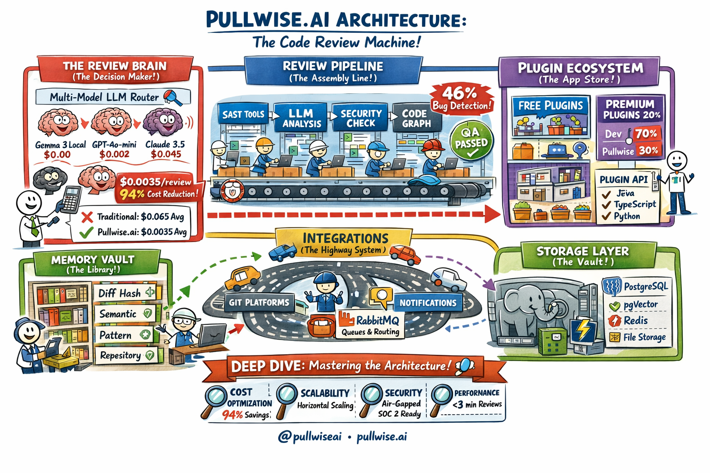

# Pullwise - A Plataforma Open Source de Code Review

<div align="center">

  

  **A Plataforma Open Source de Code Review**

  [](https://opensource.org/licenses/MIT)
  [](https://github.com/edsonmartins/pullwise.ai/actions)
  [](https://github.com/edsonmartins/pullwise.ai)

  [Website](https://pullwise.ai) • [Docs](https://docs.pullwise.ai) • [Demo](https://pullwise.ai/demo) • [Discord](https://discord.gg/pullwise)

  **Pronto para produção. Gratuito para sempre. Licença MIT.**

</div>

---

## O que é o Pullwise?

Pullwise é uma **plataforma open source e self-hosted de code review com IA** que combina análise estática (SAST) com modelos de linguagem (LLMs) para fornecer revisões de código inteligentes e automatizadas.

### O Problema

Code reviews são essenciais para a qualidade do software, mas são:
- **Demorados** — Desenvolvedores seniores gastam horas revisando PRs
- **Inconsistentes** — Diferentes revisores encontram diferentes problemas
- **Caros** — Ferramentas enterprise custam milhares por mês
- **Vendor lock-in** — Soluções proprietárias prendem seus dados

### A Solução

**Pullwise Community Edition (Licença MIT):**
- **Gratuito para sempre** — Sem cartão de crédito, sem limites de tempo
- **Self-hosted** — Seu código nunca sai da sua infraestrutura
- **IA Integrada** — Suporte multi-modelo LLM (Claude, GPT-4, modelos locais via Ollama)
- **Integração SAST** — SonarQube, ESLint, Checkstyle, PMD, SpotBugs
- **Multi-Plataforma** — GitHub, GitLab, BitBucket, Azure DevOps
- **Auto-Fix** — Aplique sugestões de IA com um clique
- **Suporte a IDEs** — Extensão VS Code e plugin IntelliJ IDEA
- **CLI** — Interface de linha de comando completa (`pullwise` / `pw`)

---

## Início Rápido

### Docker Compose (recomendado)

```bash
# Clone o repositório
git clone https://github.com/edsonmartins/pullwise.ai.git
cd pullwise.ai

# Inicie todos os serviços
docker-compose up -d

# Acesse o Pullwise
# Frontend: http://localhost:3000
# API Backend: http://localhost:8080
```

Isso inicia PostgreSQL (com pgvector), Redis, RabbitMQ, backend e frontend.

Para incluir monitoramento (Prometheus, Grafana, Jaeger):

```bash
docker-compose --profile monitoring up -d
# Grafana: http://localhost:3001
# Prometheus: http://localhost:9090
# Jaeger: http://localhost:16686
```

### Requisitos do Sistema

- **Docker** 20.10+ e Docker Compose 2.0+
- **8 GB RAM** mínimo (16 GB recomendado com monitoramento)
- **10 GB** de espaço em disco
- **Linux**, **macOS** ou **Windows** com WSL2

---

## Arquitetura



**Backend:** Java 17, Spring Boot 3.2, PostgreSQL 16 (pgvector), Redis, RabbitMQ

**Frontend:** React 18, TypeScript, Vite, Mantine UI, TanStack Query

**CLI:** Node.js, Commander.js — `npm install -g @pullwise/cli`

**Extensões IDE:** VS Code (.vsix) e plugin IntelliJ IDEA

---

## Funcionalidades Principais

### Pipeline 4-Pass de Review

O Pullwise combina análise estática com IA em um pipeline de quatro passadas, seguidas dos estágios de síntese:

1. **Pass 1 — SAST Aggregation** (paralelo): SonarQube, ESLint, Checkstyle, PMD, SpotBugs
2. **Pass 2 — LLM Primary**: análise de lógica de negócio com SAST como baseline e RAG (pgvector). Inclui **rule matching** (checklist determinístico por tipo de arquivo, resolvido por glob) e uma **plan phase** opcional que, para arquivos grandes, gera um mapa de risco para focar a análise
3. **Pass 3 — Security Focus**: revisão profunda focada em vulnerabilidades
4. **Pass 4 — Code Graph Impact**: blast-radius BFS no grafo de dependências persistido em Postgres

**Síntese**:
- **Consolidation**: severidade promovida para issues cujo arquivo cai no blast radius
- **Comment Positioning**: corrige o número de linha dos achados de LLM casando o trecho de código contra o diff (elimina *line drift*)
- **Dedup**: issues similares mesclados
- **Prioritization**: ordenação por `severity × 0.6 + risk × 0.4`
- **Reflection Filter**: remove achados de LLM que o diff prova errados (anti falso-positivo)
- **Summary**: resumo executivo em markdown com top issues e impactos

> As etapas de Comment Positioning, Reflection Filter, rule matching e plan phase são inspiradas no [Open Code Review](https://github.com/alibaba/open-code-review) (Alibaba) e configuráveis por projeto (toggles `review.position_correction`, `review.reflection_enabled`, `review.rule_guidance_enabled`, `review.plan_phase_enabled`).

### Blast-Radius v2 (Code Graph)

Análise de impacto downstream para PRs, baseada em grafo de dependências persistido em PostgreSQL (não in-memory):

- **BFS forward** via CTE recursiva sobre arestas `CALLS`, `IMPORTS_FROM`, `INHERITS` — escala em monorepos sem carregar o grafo inteiro.
- **Confidence tiers** em cada aresta: `EXTRACTED` (1.0, AST direto), `INFERRED` (0.7, simple-name resolvido), `AMBIGUOUS` (0.4, cross-language ou late binding). Confidence é multiplicada ao longo do caminho, atenuando falsos positivos.
- **Risk scoring** por nó: `depth_inverse × 0.30 + hotspot × 0.25 + security_keywords × 0.25 + test_gap × 0.20`, multiplicado pela propagated confidence.
- **Hotspots** computados a partir de churn/issues por arquivo (job batch, normalização log).
- **Cache Redis** (TTL 10 min) com chave SHA-256 sobre `(projectId, sorted files, depth, kinds)`.
- **Métricas Micrometer**: `pullwise.blast_radius.duration{cache=hit|miss}`, `nodes_visited`, `truncated`.
- **Endpoints**: `POST /api/projects/{id}/blast-radius`, `GET /api/reviews/{id}/blast-radius`, `GET /api/projects/{id}/code-graph/stats`, `POST /api/projects/{id}/code-graph/hotspots/recompute`.
- **UI**: card "Blast Radius" no review detail com top-5 nós atingidos e badges de risco.

### Roteador Multi-Modelo LLM

- **Modelos cloud**: Claude, GPT-4, Gemini Pro via OpenRouter
- **Modelos locais**: Llama 3, Mistral, Gemma via Ollama
- **Estratégias de roteamento**: `cost-optimized`, `quality-first`, `balanced`
- **Fallback**: Degradação graceful quando modelos estão indisponíveis

### Suporte Multi-Plataforma

| Plataforma | Webhooks | Comentários em PR | Status Checks |
|------------|----------|-------------------|---------------|
| GitHub | Sim | Sim | Sim |
| GitLab | Sim | Sim | Sim |
| BitBucket | Sim | Sim | Sim |
| Azure DevOps | Sim | Sim | Sim |

### Auto-Fix

- Sugestões de correção geradas por IA com score de confiança
- Preview seguro com diff de código antes de aplicar
- Operações em lote para múltiplas issues
- Suporte a rollback

### Sistema de Plugins

Extensível via arquitetura SPI:
- Linters de linguagem (Rust, Go, Python, PHP)
- Regras específicas de framework (Laravel, Django, Spring)
- Checks customizados para seu codebase

### CLI

Instala dois binários: `pullwise` (nome completo) e `pw` (alias curto), equivalentes.

```bash
npm install -g @pullwise/cli

pw auth login                    # Autenticar
pw projects list                 # Listar projetos
pw reviews trigger 42            # Disparar review para PR #42
pw reviews watch 123             # Acompanhar review em tempo real
pw review --staged               # Revisar mudanças staged localmente
pw hooks install                 # Instalar git hooks
```

### Extensões para IDEs

- **VS Code**: Diagnósticos inline, disparar reviews, visualizar issues, integração na status bar
- **IntelliJ IDEA**: External annotator, ações de review, painel de configurações, widget na status bar

---

## Edições

O Pullwise segue um **modelo open-core**:

| Funcionalidade | Community Edition | Professional | Enterprise |
|----------------|------------------|-------------|------------|
| **Preço** | **GRATUITO** | $49/dev/mês | $99/dev/mês |
| **Licença** | MIT | Proprietária | Proprietária |
| **Usuários** | 5 | 50 | Ilimitado |
| **Organizações** | 1 | 3 | Ilimitado |
| **Pipeline 4-pass** | Sim | Sim | Sim |
| **Confiabilidade do review (positioning + reflection)** | Sim | Sim | Sim |
| **Blast-Radius v2 (Code Graph)** | Sim | Sim | Sim |
| **Auto-Fix com IA** | Sim | Sim | Sim |
| **SSO/SAML** | -- | Sim | Sim |
| **Logs de Auditoria** | -- | 30 dias | 1 ano |
| **Multi-tenancy avançado** | -- | -- | Sim |
| **SLA** | Comunidade | 48h | 4h |

---

## Desenvolvimento

### Backend (Java 17 + Spring Boot 3.2 + Maven)

```bash
cd backend
./mvnw spring-boot:run -Dspring-boot.run.profiles=dev    # Servidor dev (porta 8080)
mvn test -B                                                # Rodar todos os testes
mvn test -Dtest=ClassName#methodName                       # Rodar teste específico
```

### Frontend (React 18 + TypeScript + Vite)

```bash
cd frontend
npm ci --legacy-peer-deps    # Instalar dependências
npm run dev                  # Servidor dev (porta 3000, proxy /api para 8080)
npm run build                # Build de produção
npm run lint                 # Verificação ESLint
```

### CLI

```bash
cd cli
npm ci                       # Instalar dependências
npm run dev                  # Modo dev com watch
npm run build                # Build para distribuição
```

### Testes

```bash
# Backend — JUnit 5 + Mockito + Testcontainers (requer Docker rodando)
cd backend
mvn test                                          # Suíte completa
mvn test -Dtest=BlastRadiusIntegrationTest        # Integração Postgres real
mvn test -Dtest=BlastRadiusControllerE2ETest      # E2E HTTP

# Frontend — Playwright (smoke tests)
cd frontend
npm run test:e2e:install     # Instalar Chromium (uma vez, ~150 MB)
npm run test:e2e             # Sobe Vite dev server e roda specs
```

A feature Blast-Radius v2 tem **67 testes Java** (unit + integração com Postgres real via Testcontainers + E2E HTTP) e **2 testes Playwright** validando o card no review detail.

---

## Deploy

### Docker Compose (recomendado)

```bash
docker-compose up -d
```

Variáveis de ambiente para produção:

| Variável | Descrição | Padrão |
|----------|-----------|--------|
| `DB_HOST` | Host do PostgreSQL | `localhost` |
| `DB_PASSWORD` | Senha do banco de dados | `pullwise` |
| `JWT_SECRET` | Chave de assinatura JWT (mín. 32 caracteres) | -- |
| `REDIS_HOST` | Host do Redis | `localhost` |
| `OPENROUTER_API_KEY` | Chave da API OpenRouter para LLMs cloud | -- |
| `PULLWISE_ENCRYPTION_KEY` | Chave AES-256 para configs sensíveis | -- |

---

## Contribuindo

Contribuições são bem-vindas! Áreas prioritárias:

- Integrações de linguagem e plugins
- Integrações de plataforma
- Melhorias na documentação
- Reports de bugs e testes

Veja as [Good First Issues](https://github.com/edsonmartins/pullwise.ai/issues?q=label%3A%22good+first+issue%22+is%3Aopen+is%3Aissue) para começar.

---

## Licença

**Community Edition** — [Licença MIT](LICENSE)

Livre para usar, modificar e distribuir. Para sempre.

---

<div align="center">

  **[Voltar ao Topo](#pullwise---a-plataforma-open-source-de-code-review)**

  Feito com dedicação pela comunidade Pullwise

  **pullwise.ai** • [@pullwise](https://twitter.com/pullwise) • [hello@pullwise.ai](mailto:hello@pullwise.ai)

</div>
