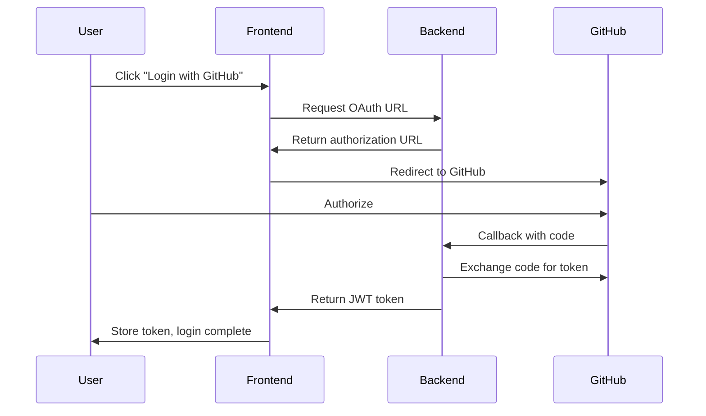

# API Reference

Complete API reference for integrating with Pullwise.

## Overview

The Pullwise API is a RESTful API that allows you to:

- Manage organizations and projects
- Trigger and retrieve code reviews
- Apply auto-fixes
- Retrieve analytics and metrics
- Configure webhooks

## Base URL

| Environment | URL |
|-------------|-----|
| Production | `https://api.pullwise.ai` |
| Staging | `https://staging-api.pullwise.ai` |
| Local | `http://localhost:8080` |

## Interactive API Documentation

You can explore the full API specification using Scalar:

```yaml
# Scalar configuration (coming soon)
url: /api/openapi.yaml
```

The interactive API reference will be available once the OpenAPI specification is fully configured.

## Authentication

Pullwise uses **JWT (JSON Web Token)** authentication via GitHub OAuth2.

### OAuth2 Flow



### Using the API

Once you have a JWT token, include it in the `Authorization` header:

```bash
curl -H "Authorization: Bearer YOUR_JWT_TOKEN" \
  https://api.pullwise.ai/api/reviews
```

### Token Refresh

JWT tokens expire after 24 hours. Refresh your token:

```bash
curl -X POST \
  -H "Content-Type: application/json" \
  https://api.pullwise.ai/api/auth/refresh \
  -d '{
    "refreshToken": "YOUR_REFRESH_TOKEN"
  }'
```

## Rate Limiting

The API has the following rate limits:

| Tier | Requests | Burst |
|------|----------|-------|
| Free | 100/min | 20 |
| Professional | 500/min | 50 |
| Enterprise | Unlimited | 100 |

### Rate Limit Headers

All API responses include rate limit headers:

```http
X-RateLimit-Limit: 100
X-RateLimit-Remaining: 95
X-RateLimit-Reset: 1699999999
```

### Handling Rate Limits

When rate limited, you'll receive:

```http
HTTP/429 Too Many Requests
Retry-After: 60
X-RateLimit-Remaining: 0
```

## Error Handling

### Error Response Format

```json
{
  "error": "Error Type",
  "message": "Human-readable error message",
  "violations": ["field1: error details", "field2: error details"]
}
```

### HTTP Status Codes

| Code | Description |
|------|-------------|
| 200 | Success |
| 201 | Created |
| 204 | No Content |
| 400 | Bad Request |
| 401 | Unauthorized |
| 403 | Forbidden |
| 404 | Not Found |
| 409 | Conflict |
| 429 | Rate Limited |
| 500 | Internal Server Error |

## Common Operations

### Trigger a Review

```bash
curl -X POST \
  -H "Authorization: Bearer YOUR_JWT_TOKEN" \
  -H "Content-Type: application/json" \
  https://api.pullwise.ai/api/reviews \
  -d '{
    "projectId": 123,
    "pullRequestId": "pr-123",
    "branch": "feature/new-feature",
    "commitSha": "abc123def456",
    "runSast": true,
    "runLlm": true
  }'
```

### Get Review Results

```bash
curl -H "Authorization: Bearer YOUR_JWT_TOKEN" \
  https://api.pullwise.ai/api/reviews/456
```

### List Issues

```bash
curl -H "Authorization: Bearer YOUR_JWT_TOKEN" \
  https://api.pullwise.ai/api/reviews/456/issues?severity=CRITICAL
```

### Apply Auto-Fix

```bash
curl -X POST \
  -H "Authorization: Bearer YOUR_JWT_TOKEN" \
  -H "Content-Type: application/json" \
  https://api.pullwise.ai/api/autofix/apply \
  -d '{
    "id": 789,
    "createBranch": true,
    "branchName": "fix/issue-789"
  }'
```

## Webhooks

Pullwise can send webhook notifications to your endpoints when events occur:

### Event Types

- `review.completed` - Review finished successfully
- `review.failed` - Review failed
- `issue.detected` - New issue found during review

### Webhook Payload

```json
{
  "eventId": "evt_123abc",
  "eventType": "review.completed",
  "timestamp": "2024-01-01T12:00:00Z",
  "data": {
    "reviewId": 456,
    "projectId": 123,
    "totalIssues": 12,
    "criticalIssues": 1
  }
}
```

## SDKs & Libraries

Official SDKs:

| Language | Package | Repository |
|----------|---------|------------|
| JavaScript | `@pullwise/javascript-sdk` | [GitHub](https://github.com/pullwise/js-sdk) |
| Python | `pullwise-python` | [GitHub](https://github.com/pullwise/python-sdk) |
| Java | `com.pullwise:pullwise-java-sdk` | [GitHub](https://github.com/pullwise/java-sdk) |
| Go | `github.com/pullwise/go-sdk` | [GitHub](https://github.com/pullwise/go-sdk) |

## Changelog

### v1.0.0 (2024-01-01)

- Initial API release
- OAuth2 authentication
- Review management
- Auto-fix operations
- Analytics endpoints
- Webhook support

## Support

- **Documentation**: [docs.pullwise.ai](https://docs.pullwise.ai)
- **Issues**: [GitHub Issues](https://github.com/integralltech/pullwise-ai/issues)
- **Email**: [api@pullwise.ai](mailto:api@pullwise.ai)

## Related Docs

- [Authentication Guide](/docs/api/authentication)
- [Webhook Reference](/docs/api/webhooks)
- [User Guide](/docs/category/user-guide)
