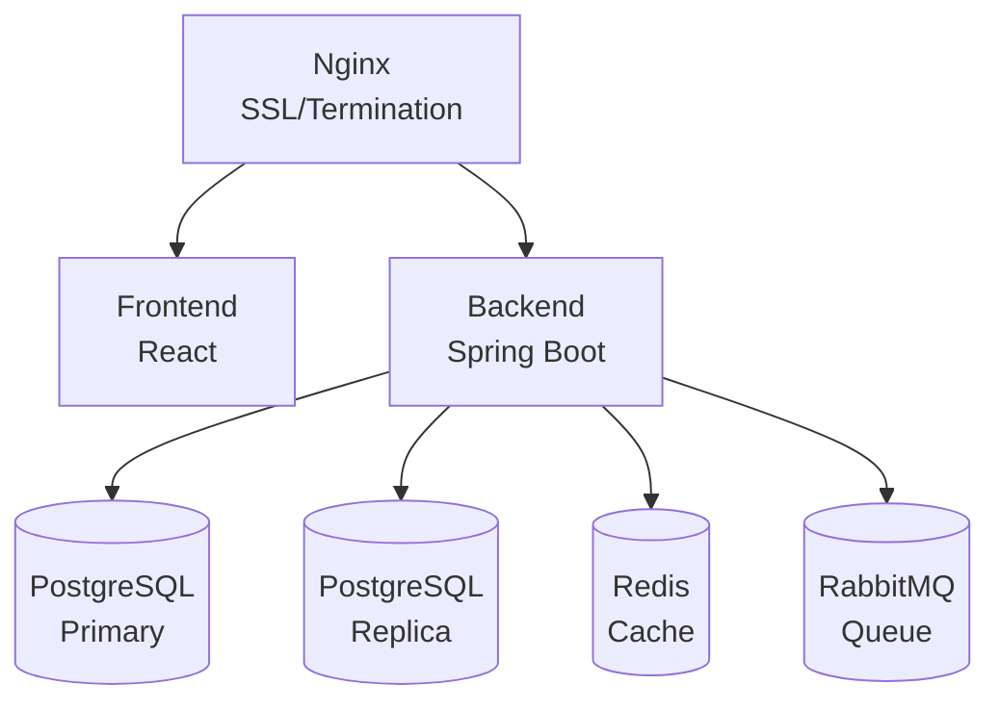

# Docker Production Deployment

Production-ready Docker deployment guide for Pullwise.

## Overview

This guide covers deploying Pullwise to production using Docker with:

- High availability
- SSL/TLS termination
- Volume management
- Log aggregation
- Health checks
- Resource limits

## Prerequisites

- **Docker** 20.10+
- **Docker Compose** 2.0+
- **SSL Certificate** (Let's Encrypt or commercial)
- **Domain name** configured

## Architecture



## Production Docker Compose

Create `docker-compose.prod.yml`:

```yaml
version: '3.8'

services:
  # Reverse proxy
  nginx:
    image: nginx:alpine
    container_name: pullwise-nginx
    ports:
      - "80:80"
      - "443:443"
    volumes:
      - ./nginx/nginx.conf:/etc/nginx/nginx.conf:ro
      - ./nginx/ssl:/etc/nginx/ssl:ro
      - nginx_logs:/var/log/nginx
    depends_on:
      - frontend
      - backend
    restart: always
    networks:
      - pullwise-network

  # Frontend
  frontend:
    image: pullwise/frontend:1.0.0
    container_name: pullwise-frontend
    environment:
      VITE_API_URL: https://pullwise.example.com/api
      VITE_WS_URL: wss://pullwise.example.com/ws
    restart: always
    networks:
      - pullwise-network
    deploy:
      resources:
        limits:
          cpus: '1.0'
          memory: 512M
        reservations:
          cpus: '0.25'
          memory: 128M

  # Backend (primary)
  backend:
    image: pullwise/backend:1.0.0
    container_name: pullwise-backend
    environment:
      SPRING_PROFILES_ACTIVE: prod
      SPRING_DATASOURCE_URL: jdbc:postgresql://postgres-primary:5432/pullwise
      SPRING_DATASOURCE_USERNAME: pullwise
      SPRING_DATASOURCE_PASSWORD: ${POSTGRES_PASSWORD}
      SPRING_REDIS_HOST: redis
      SPRING_REDIS_PASSWORD: ${REDIS_PASSWORD}
      SPRING_RABBITMQ_HOST: rabbitmq
      SPRING_RABBITMQ_PASSWORD: ${RABBITMQ_PASSWORD}
      JWT_SECRET: ${JWT_SECRET}
      GITHUB_CLIENT_ID: ${GITHUB_CLIENT_ID}
      GITHUB_CLIENT_SECRET: ${GITHUB_CLIENT_SECRET}
      OPENROUTER_API_KEY: ${OPENROUTER_API_KEY}
    env_file:
      - .env.prod
    restart: always
    depends_on:
      postgres-primary:
        condition: service_healthy
      redis:
        condition: service_healthy
    volumes:
      - backend_logs:/app/logs
      - plugin_data:/opt/pullwise/plugins
    networks:
      - pullwise-network
    deploy:
      resources:
        limits:
          cpus: '4.0'
          memory: 2G
        reservations:
          cpus: '1.0'
          memory: 1G
    healthcheck:
      test: ["CMD", "curl", "-f", "http://localhost:8080/actuator/health"]
      interval: 30s
      timeout: 10s
      retries: 3
      start_period: 60s

  # PostgreSQL Primary
  postgres-primary:
    image: pgvector/pgvector:pg16
    container_name: pullwise-postgres-primary
    environment:
      POSTGRES_DB: pullwise
      POSTGRES_USER: pullwise
      POSTGRES_PASSWORD: ${POSTGRES_PASSWORD}
      POSTGRES_REPLICATION_USER: replicator
      POSTGRES_REPLICATION_PASSWORD: ${POSTGRES_REPLICATION_PASSWORD}
    volumes:
      - postgres_primary_data:/var/lib/postgresql/data
      - ./postgres/init.sql:/docker-entrypoint-initdb.d/init.sql
    networks:
      - pullwise-network
    restart: always
    healthcheck:
      test: ["CMD-SHELL", "pg_isready -U pullwise"]
      interval: 10s
      timeout: 5s
      retries: 5
    deploy:
      resources:
        limits:
          cpus: '2.0'
          memory: 2G

  # PostgreSQL Replica (optional)
  postgres-replica:
    image: pgvector/pgvector:pg16
    container_name: pullwise-postgres-replica
    environment:
      POSTGRES_USER: pullwise
      POSTGRES_PASSWORD: ${POSTGRES_PASSWORD}
      PGUSER: pullwise
    volumes:
      - postgres_replica_data:/var/lib/postgresql/data
    networks:
      - pullwise-network
    restart: always
    depends_on:
      - postgres-primary

  # Redis
  redis:
    image: redis:7-alpine
    container_name: pullwise-redis
    command: redis-server --appendonly yes --requirepass ${REDIS_PASSWORD}
    volumes:
      - redis_data:/data
    networks:
      - pullwise-network
    restart: always
    healthcheck:
      test: ["CMD", "redis-cli", "--raw", "incr", "ping"]
      interval: 10s
      timeout: 3s
      retries: 5
    deploy:
      resources:
        limits:
          cpus: '1.0'
          memory: 512M

  # RabbitMQ
  rabbitmq:
    image: rabbitmq:3-management-alpine
    container_name: pullwise-rabbitmq
    environment:
      RABBITMQ_DEFAULT_USER: pullwise
      RABBITMQ_DEFAULT_PASS: ${RABBITMQ_PASSWORD}
      RABBITMQ_SERVER_ADDITIONAL_ERL_ARGS: -rabbit log_levels [{connection,error},{default,warning}]
    volumes:
      - rabbitmq_data:/var/lib/rabbitmq
    networks:
      - pullwise-network
    restart: always
    healthcheck:
      test: ["CMD", "rabbitmq-diagnostics", "-q", "ping"]
      interval: 30s
      timeout: 10s
      retries: 5
    deploy:
      resources:
        limits:
          cpus: '1.0'
          memory: 1G

networks:
  pullwise-network:
    driver: bridge
    name: pullwise-prod-network

volumes:
  postgres_primary_data:
    driver: local
  postgres_replica_data:
    driver: local
  redis_data:
    driver: local
  rabbitmq_data:
    driver: local
  backend_logs:
    driver: local
  plugin_data:
    driver: local
  nginx_logs:
    driver: local
```

## Environment Variables

Create `.env.prod`:

```bash
# Database
POSTGRES_PASSWORD=your_secure_postgres_password
POSTGRES_REPLICATION_PASSWORD=your_secure_replication_password

# Redis
REDIS_PASSWORD=your_secure_redis_password

# RabbitMQ
RABBITMQ_PASSWORD=your_secure_rabbitmq_password

# JWT
JWT_SECRET=your_very_long_random_secret_key_min_256_bits_here

# GitHub OAuth
GITHUB_CLIENT_ID=your_github_client_id
GITHUB_CLIENT_SECRET=your_github_client_secret

# LLM Provider
OPENROUTER_API_KEY=sk-or-v1-your-key-here

# Backup
BACKUP_SCHEDULE=0 2 * * *
BACKUP_RETENTION_DAYS=30
```

## Nginx Configuration

Create `nginx/nginx.conf`:

```nginx
user nginx;
worker_processes auto;
error_log /var/log/nginx/error.log warn;
pid /var/run/nginx.pid;

events {
    worker_connections 2048;
    use epoll;
}

http {
    include /etc/nginx/mime.types;
    default_type application/octet-stream;

    # Logging
    log_format main '$remote_addr - $remote_user [$time_local] "$request" '
                    '$status $body_bytes_sent "$http_referer" '
                    '"$http_user_agent" "$http_x_forwarded_for"';
    access_log /var/log/nginx/access.log main;

    # Performance
    sendfile on;
    tcp_nopush on;
    tcp_nodelay on;
    keepalive_timeout 65;
    types_hash_max_size 2048;
    client_max_body_size 20M;

    # Gzip
    gzip on;
    gzip_vary on;
    gzip_proxied any;
    gzip_comp_level 6;
    gzip_types text/plain text/css text/xml text/javascript
               application/json application/javascript application/xml+rss;

    # Upstream backend
    upstream backend {
        server backend:8080;
    }

    # Upstream frontend
    upstream frontend {
        server frontend:80;
    }

    # HTTP to HTTPS redirect
    server {
        listen 80;
        server_name pullwise.example.com;
        return 301 https://$server_name$request_uri;
    }

    # HTTPS server
    server {
        listen 443 ssl http2;
        server_name pullwise.example.com;

        # SSL certificates
        ssl_certificate /etc/nginx/ssl/fullchain.pem;
        ssl_certificate_key /etc/nginx/ssl/privkey.pem;
        ssl_trusted_certificate /etc/nginx/ssl/chain.pem;

        # SSL configuration
        ssl_protocols TLSv1.2 TLSv1.3;
        ssl_ciphers HIGH:!aNULL:!MD5;
        ssl_prefer_server_ciphers on;
        ssl_session_cache shared:SSL:10m;
        ssl_session_timeout 10m;

        # Security headers
        add_header Strict-Transport-Security "max-age=31536000; includeSubDomains" always;
        add_header X-Frame-Options "SAMEORIGIN" always;
        add_header X-Content-Type-Options "nosniff" always;
        add_header X-XSS-Protection "1; mode=block" always;

        # Frontend
        location / {
            proxy_pass http://frontend;
            proxy_set_header Host $host;
            proxy_set_header X-Real-IP $remote_addr;
            proxy_set_header X-Forwarded-For $proxy_add_x_forwarded_for;
            proxy_set_header X-Forwarded-Proto $scheme;
        }

        # Backend API
        location /api {
            proxy_pass http://backend;
            proxy_set_header Host $host;
            proxy_set_header X-Real-IP $remote_addr;
            proxy_set_header X-Forwarded-For $proxy_add_x_forwarded_for;
            proxy_set_header X-Forwarded-Proto $scheme;

            # Timeouts for long-running requests
            proxy_connect_timeout 300s;
            proxy_send_timeout 300s;
            proxy_read_timeout 300s;
        }

        # WebSocket
        location /ws {
            proxy_pass http://backend;
            proxy_http_version 1.1;
            proxy_set_header Upgrade $http_upgrade;
            proxy_set_header Connection "upgrade";
            proxy_set_header Host $host;
            proxy_read_timeout 86400;
        }

        # Health check
        location /health {
            access_log off;
            return 200 "healthy\n";
            add_header Content-Type text/plain;
        }
    }
}
```

## SSL Certificates

### Let's Encrypt with Certbot

```bash
# Install certbot
sudo apt install certbot

# Generate certificate
sudo certbot certonly --standalone \
  -d pullwise.example.com \
  --email your@email.com \
  --agree-tos

# Copy certificates
sudo cp /etc/letsencrypt/live/pullwise.example.com/fullchain.pem nginx/ssl/
sudo cp /etc/letsencrypt/live/pullwise.example.com/privkey.pem nginx/ssl/
sudo cp /etc/letsencrypt/live/pullwise.example.com/chain.pem nginx/ssl/

# Set permissions
sudo chmod 644 nginx/ssl/*.pem
```

### Auto-renewal

```bash
# Test renewal
sudo certbot renew --dry-run

# Certbot auto-renews by default via systemd timer
```

## Deploy

```bash
# Build images
docker-compose -f docker-compose.prod.yml build

# Start services
docker-compose -f docker-compose.prod.yml up -d

# Check status
docker-compose -f docker-compose.prod.yml ps

# View logs
docker-compose -f docker-compose.prod.yml logs -f
```

## Backup Strategy

### Database Backup

```bash
# Backup script
cat > backup.sh << 'EOF'
#!/bin/bash
BACKUP_DIR="/backups/postgres"
TIMESTAMP=$(date +%Y%m%d_%H%M%S)

docker exec pullwise-postgres-primary \
  pg_dump -U pullwise pullwise | gzip > \
  $BACKUP_DIR/pullwise_$TIMESTAMP.sql.gz

# Keep last 30 days
find $BACKUP_DIR -mtime +30 -delete
EOF

chmod +x backup.sh

# Add to crontab
0 2 * * * /path/to/backup.sh
```

### Volume Backup

```bash
# Backup all volumes
docker run --rm \
  -v pullwise_postgres_primary_data:/data \
  -v /backups:/backup \
  alpine tar czf /backup/postgres_$(date +%Y%m%d).tar.gz -C /data .
```

## Monitoring

### Health Checks

```bash
# Backend health
curl https://pullwise.example.com/api/v2/health

# Database connection
docker exec pullwise-postgres-primary \
  pg_isready -U pullwise

# Redis connection
docker exec pullwise-redis redis-cli ping
```

### Metrics

Pullwise exposes Prometheus metrics:

```yaml
# prometheus.yml
scrape_configs:
  - job_name: 'pullwise'
    static_configs:
      - targets: ['pullwise.example.com:8080']
    metrics_path: '/actuator/prometheus'
```

## Scaling

### Horizontal Scaling

```yaml
# Scale backend
docker-compose -f docker-compose.prod.yml up -d --scale backend=3
```

### Load Balancing

Use HAProxy or cloud load balancer:

```yaml
# docker-compose.scale.yml
services:
  backend:
    deploy:
      replicas: 3

  nginx:
    # Use external load balancer
    ports:
      - "8080:80"
```

## Rolling Updates

```bash
# Pull new images
docker-compose -f docker-compose.prod.yml pull

# Update with zero downtime
docker-compose -f docker-compose.prod.yml up -d --no-deps backend

# Wait for health checks
sleep 60

# Update remaining services
docker-compose -f docker-compose.prod.yml up -d
```

## Troubleshooting

### Container Won't Start

```bash
# Check logs
docker-compose -f docker-compose.prod.yml logs backend

# Check resource usage
docker stats

# Check disk space
df -h
```

### Database Connection Issues

```bash
# Verify PostgreSQL
docker exec pullwise-postgres-primary \
  psql -U pullwise -d pullwise -c "SELECT 1"

# Check network
docker network inspect pullwise-prod-network
```

### SSL Issues

```bash
# Verify certificates
openssl x509 -in nginx/ssl/fullchain.pem -text -noout

# Test SSL
openssl s_client -connect pullwise.example.com:443
```

## Next Steps

- [Kubernetes Deployment](/docs/deployment/kubernetes/helm) - K8s deployment
- [Monitoring](/docs/deployment/monitoring/prometheus) - Monitoring setup
- [Security](/docs/deployment/security/ssl-https) - Security hardening
