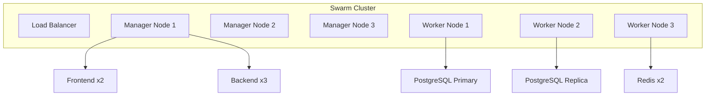

# Docker Swarm Deployment

Deploy Pullwise using Docker Swarm for high availability.

## Overview

Docker Swarm provides:

- Built-in load balancing
- Rolling updates
- Service discovery
- Secret management
- High availability

## Architecture



## Initialize Swarm

### Create Swarm Cluster

```bash
# On first manager node
docker swarm init --advertise-addr <MANAGER-IP>

# Get join token for workers
docker swarm join-token worker

# Get join token for managers
docker swarm join-token manager
```

### Join Worker Nodes

```bash
# On worker nodes
docker swarm join --token <TOKEN> <MANAGER-IP>:2377
```

### Verify Cluster

```bash
# List nodes
docker node ls

# Check services
docker service ls
```

## Deploy Stack

### Docker Compose for Swarm

Create `docker-compose.swarm.yml`:

```yaml
version: '3.8'

services:
  # Frontend service
  frontend:
    image: pullwise/frontend:1.0.0
    environment:
      VITE_API_URL: https://pullwise.example.com/api
      VITE_WS_URL: wss://pullwise.example.com/ws
    networks:
      - pullwise-network
    deploy:
      replicas: 2
      update_config:
        parallelism: 1
        delay: 10s
        order: start-first
      rollback_config:
        parallelism: 1
        delay: 5s
      restart_policy:
        condition: on-failure
        delay: 5s
        max_attempts: 3
      placement:
        constraints:
          - node.labels.type == web

  # Backend service
  backend:
    image: pullwise/backend:1.0.0
    environment:
      SPRING_PROFILES_ACTIVE: prod
      SPRING_DATASOURCE_URL: jdbc:postgresql://postgres:5432/pullwise
      SPRING_REDIS_HOST: redis
      SPRING_RABBITMQ_HOST: rabbitmq
    env_file:
      - .env.swarm
    networks:
      - pullwise-network
    secrets:
      - postgres_password
      - jwt_secret
      - github_client_secret
    deploy:
      replicas: 3
      update_config:
        parallelism: 1
        delay: 30s
        order: start-first
      restart_policy:
        condition: on-failure
        delay: 10s
        max_attempts: 3
      resources:
        limits:
          cpus: '2.0'
          memory: 2G
        reservations:
          cpus: '0.5'
          memory: 512M
      placement:
        constraints:
          - node.labels.type == app

  # PostgreSQL
  postgres:
    image: pgvector/pgvector:pg16
    environment:
      POSTGRES_DB: pullwise
      POSTGRES_USER: pullwise
    volumes:
      - postgres_data:/var/lib/postgresql/data
    networks:
      - pullwise-network
    secrets:
      - postgres_password
    deploy:
      replicas: 1
      placement:
        constraints:
          - node.labels.db == true

  # Redis
  redis:
    image: redis:7-alpine
    command: redis-server --appendonly yes --requirepass ${REDIS_PASSWORD}
    volumes:
      - redis_data:/data
    networks:
      - pullwise-network
    secrets:
      - redis_password
    deploy:
      replicas: 1
      placement:
        constraints:
          - node.labels.cache == true

  # RabbitMQ
  rabbitmq:
    image: rabbitmq:3-management-alpine
    environment:
      RABBITMQ_DEFAULT_USER: pullwise
      RABBITMQ_DEFAULT_PASS_FILE: /run/secrets/rabbitmq_password
    volumes:
      - rabbitmq_data:/var/lib/rabbitmq
    networks:
      - pullwise-network
    secrets:
      - rabbitmq_password
    deploy:
      replicas: 1
      placement:
        constraints:
          - node.labels.queue == true

networks:
  pullwise-network:
    driver: overlay
    attachable: true

volumes:
  postgres_data:
    driver: local
  redis_data:
    driver: local
  rabbitmq_data:
    driver: local

secrets:
  postgres_password:
    external: true
  jwt_secret:
    external: true
  github_client_secret:
    external: true
  redis_password:
    external: true
  rabbitmq_password:
    external: true
```

## Deploy Stack

```bash
# Deploy stack
docker stack deploy -c docker-compose.swarm.yml pullwise

# Check services
docker stack services pullwise

# Check tasks
docker stack ps pullwise
```

## Secrets Management

### Create Secrets

```bash
# Create secrets
echo "your_postgres_password" | docker secret create postgres_password -
echo "your_jwt_secret" | docker secret create jwt_secret -
echo "your_github_secret" | docker secret create github_client_secret -
echo "your_redis_password" | docker secret create redis_password -
echo "your_rabbitmq_password" | docker secret create rabbitmq_password -

# List secrets
docker secret ls
```

### Update Secret

```bash
# Secrets are immutable, create new version
echo "new_password" | docker secret create postgres_password_v2 -

# Update service to use new secret
docker service update \
  --secret-add source=postgres_password_v2,target=POSTGRES_PASSWORD \
  pullwise_postgres

# Remove old secret
docker secret rm postgres_password
```

## Node Labels

### Label Nodes

```bash
# Label manager nodes
docker node update --label-add type=web manager1
docker node update --label-add type=app manager2

# Label worker nodes
docker node update --label-add type=app worker1
docker node update --label-add type=db worker1
docker node update --label-add type=cache worker2
docker node update --label-add type=queue worker3
```

### Verify Labels

```bash
# List nodes with labels
docker node ls --format "table {{.Hostname}}\t{{.Labels}}"
```

## Service Scaling

### Scale Services

```bash
# Scale backend to 5 replicas
docker service scale pullwise_backend=5

# Scale down
docker service scale pullwise_backend=2
```

### Auto-scaling

Use external tools for auto-scaling:

```bash
# Install autoscaler
git clone https://github.com/docker/swarmkit
cd swarmkit
make build
make bin
```

## Rolling Updates

### Update Service

```bash
# Update image
docker service update \
  --image pullwise/backend:1.1.0 \
  pullwise_backend

# Update with delay
docker service update \
  --image pullwise/backend:1.1.0 \
  --update-delay 30s \
  --update-parallelism 1 \
  pullwise_backend
```

### Rollback

```bash
# Rollback to previous version
docker service rollback pullwise_backend
```

## Health Checks

### Configure Health Checks

```yaml
services:
  backend:
    deploy:
      restart_policy:
        condition: on-failure
    healthcheck:
      test: ["CMD", "curl", "-f", "http://localhost:8080/actuator/health"]
      interval: 30s
      timeout: 10s
      retries: 3
      start_period: 60s
```

## Monitoring

### Visualize Cluster

```bash
# Use Portainer
docker run -d -p 9000:9000 \
  -v /var/run/docker.sock:/var/run/docker.sock \
  --name portainer \
  portainer/portainer-ce

# Access at http://localhost:9000
```

### Metrics

```bash
# Get service stats
docker stats pullwise_backend

# Get service logs
docker service logs -f pullwise_backend
```

## Backup

### Backup Volumes

```bash
# Backup PostgreSQL volume
docker run --rm \
  -v pullwise_postgres_data:/data \
  -v $(pwd):/backup \
  alpine tar czf /backup/postgres_$(date +%Y%m%d).tar.gz -C /data .
```

### Backup Config

```bash
# Save stack configuration
docker stack config pullwise > stack-backup.yml

# Save secrets
docker secret ls > secrets-backup.txt
```

## Troubleshooting

### Service Not Starting

```bash
# Check service logs
docker service logs -f pullwise_backend

# Check task status
docker stack ps pullwise --no-trunc
```

### Networking Issues

```bash
# Check overlay network
docker network inspect pullwise_pullwise-network

# Test service connectivity
docker exec -it pullwise_backend.1.<id> ping postgres
```

## Removal

### Remove Stack

```bash
# Remove stack (keeps volumes)
docker stack rm pullwise

# Remove stack with volumes
docker stack rm -v pullwise
```

### Remove Swarm

```bash
# On workers
docker swarm leave

# On managers
docker swarm leave --force
```

## Next Steps

- [Helm](/docs/deployment/kubernetes/helm) - Helm deployment
- [Production](/docs/deployment/docker/production) - Production setup
- [Monitoring](/docs/deployment/monitoring/prometheus) - Monitoring guide
