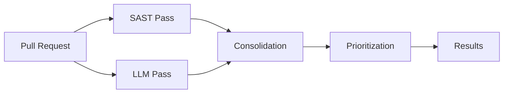

# Developer Guide Overview

Welcome to the Pullwise developer guide. This section covers everything you need to know to contribute to Pullwise.

## Architecture Overview

Pullwise consists of:

```
┌─────────────────────────────────────────────────────────────┐
│                      PULLWISE PLATFORM                       │
├─────────────────────────────────────────────────────────────┤
│                                                              │
│  ┌──────────────┐    ┌──────────────┐    ┌──────────────┐ │
│  │   Frontend   │    │   Backend    │    │  PostgreSQL  │ │
│  │   (React)    │◀──▶│ (Spring Boot)│◀──▶│  + pgvector  │ │
│  │   Vite 5     │    │   Java 17    │    │   Flyway     │ │
│  └──────────────┘    └──────────────┘    └──────────────┘ │
│         │                    │                    │         │
│         │         ┌──────────┴──────────┐                │
│         │         │                     │                │
│         ▼         ▼                     ▼                │
│  ┌──────────────┐ ┌──────────┐    ┌──────────────┐    │
│  │  Netlify/    │ │  Redis   │    │  RabbitMQ    │    │
│  │  Nginx       │ │  Cache   │    │  Queue       │    │
│  └──────────────┘ └──────────┘    └──────────────┘    │
│                                                              │
│         ▼                                                    │
│  GitHub / GitLab / BitBucket (Webhooks + API)               │
│                                                              │
└─────────────────────────────────────────────────────────────┘
```

## Tech Stack

### Frontend

| Technology | Version | Purpose |
|------------|---------|---------|
| **React** | 18.3 | UI framework |
| **TypeScript** | 5.5 | Type safety |
| **Vite** | 5.4 | Build tool |
| **Mantine UI** | 8.3 | UI components |
| **TanStack Query** | 5.0 | Server state |
| **Zustand** | 4.4 | Client state |
| **React Router** | 6.20 | Routing |
| **Monaco Editor** | Latest | Code editor |

### Backend

| Technology | Version | Purpose |
|------------|---------|---------|
| **Spring Boot** | 3.2 | Application framework |
| **Java** | 17 | Language |
| **PostgreSQL** | 16 + pgvector | Database |
| **Redis** | 7 | Cache |
| **RabbitMQ** | 3.12 | Message queue |
| **LangChain4j** | Latest | LLM integration |
| **Flyway** | Latest | Migrations |

## Project Structure

```
pullwise-ai/
├── frontend/                 # React frontend
│   ├── src/
│   │   ├── components/       # UI components
│   │   ├── pages/            # Page components
│   │   ├── lib/              # Utilities and API client
│   │   └── store/            # Zustand stores
│   ├── public/               # Static assets
│   └── package.json
│
├── backend/                  # Spring Boot backend
│   └── src/main/
│       ├── java/com/pullwise/
│       │   ├── api/
│       │   │   ├── application/service/   # Business logic
│       │   │   ├── infrastructure/         # External integrations
│       │   │   │   ├── rest/              # REST controllers
│       │   │   │   ├── persistence/       # JPA repositories
│       │   │   │   ├── security/          # Security config
│       │   │   │   └── websockets/        # WebSocket handlers
│       │   │   └── domain/                # Domain models
│       │   └── config/                    # Spring configuration
│       └── resources/
│           ├── application.yml            # Main config
│           ├── application-dev.yml        # Dev config
│           └── db/migration/              # Flyway migrations
│
└── docs/                     # Documentation (Docusaurus)
```

## Key Concepts

### Review Pipeline

Pullwise processes code reviews through a multi-pass pipeline:



### Plugin System

Pullwise uses a plugin architecture for extensibility:

- **SPI (Service Provider Interface)** for Java plugins
- **External tool executors** for Rust-based tools (Biome, Ruff)
- **Configuration-driven** plugin behavior

### LLM Integration

Multiple LLM providers supported:

- **OpenRouter** - Cloud models (GPT-4, Claude, Gemini)
- **Ollama** - Local models (Llama, Mistral, Gemma)
- **Cost optimization** - Automatic model routing

## Development Workflow

### 1. Fork and Clone

```bash
# Fork the repository
git clone https://github.com/YOUR_USERNAME/pullwise-ai.git
cd pullwise-ai
```

### 2. Install Dependencies

```bash
# Backend
cd backend
./mvnw clean install

# Frontend
cd ../frontend
npm install
```

### 3. Start Development

```bash
# Terminal 1: Backend
cd backend
./mvnw spring-boot:run -Dspring-boot.run.profiles=dev

# Terminal 2: Frontend
cd frontend
npm run dev
```

### 4. Create Feature Branch

```bash
git checkout -b feature/amazing-feature
```

### 5. Make Changes

- Follow code style guidelines
- Write tests
- Update documentation

### 6. Test Changes

```bash
# Backend tests
cd backend
./mvnw test

# Frontend tests
cd frontend
npm run lint
npm run test
```

### 7. Commit and Push

```bash
git add .
git commit -m "feat: add amazing feature"
git push origin feature/amazing-feature
```

### 8. Create Pull Request

- Describe your changes
- Link related issues
- Request review from maintainers

## Contributing Guidelines

### Code Style

- **Backend**: Follow [Google Java Style Guide](https://google.github.io/styleguide/javaguide.html)
- **Frontend**: Follow [Airbnb JavaScript Style Guide](https://github.com/airbnb/javascript)

### Commit Messages

Follow [Conventional Commits](https://www.conventionalcommits.org/):

```
feat: add auto-fix feature
fix: resolve webhook parsing bug
docs: update plugin development guide
refactor: simplify review pipeline
test: add integration tests for auth
```

### Pull Request Guidelines

- **Keep PRs focused** - One feature per PR
- **Write clear descriptions** - What and why
- **Link issues** - Connect to related work
- **Add tests** - Maintain test coverage
- **Update docs** - Keep documentation current

## Testing

### Backend Tests

```bash
# Unit tests
./mvnw test

# Integration tests
./mvnw verify -P integration-test

# With coverage
./mvnw test jacoco:report
```

### Frontend Tests

```bash
# Lint
npm run lint

# Type check
npm run type-check

# Unit tests
npm run test
```

## Documentation

- **API docs**: Use Javadoc/TypeDoc annotations
- **User docs**: Update `/docs` directory
- **Code comments**: Explain complex logic

## Getting Help

- **Documentation**: [docs.pullwise.ai](https://docs.pullwise.ai)
- **Discord**: [Join community](https://discord.gg/pullwise)
- **GitHub Issues**: [Report issues](https://github.com/integralltech/pullwise-ai/issues)

## Next Steps

- [Setup](/docs/developer-guide/setup/environment) - Set up your environment
- [Architecture](/docs/developer-guide/architecture/backend-architecture) - Learn the architecture
- [Contributing](/docs/developer-guide/contributing/workflow) - Contribution workflow
