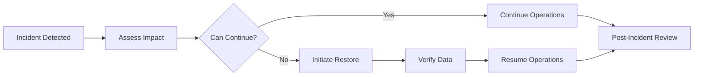

# Backups and Restore

Backup and restore procedures for Pullwise.

## Overview

Pullwise requires regular backups of:
- PostgreSQL database
- Redis cache (optional)
- Configuration files
- Plugin data

## PostgreSQL Backups

### pg_dump Backup

```bash
# Full backup
pg_dump -h localhost -U pullwise -d pullwise \
  -F c -f pullwise_backup_$(date +%Y%m%d).dump

# Custom format backup (recommended)
pg_dump -h localhost -U pullwise -d pullwise \
  -F d -f /backups/pullwise_$(date +%Y%m%d)/

# Schema only
pg_dump -h localhost -U pullwise -d pullwise \
  --schema-only -f schema_backup.sql

# Data only
pg_dump -h localhost -U pullwise -d pullwise \
  --data-only -f data_backup.sql
```

### Automated Backup Script

```bash
#!/bin/bash
# /usr/local/bin/backup-pullwise.sh

set -e

BACKUP_DIR="/backups/postgres"
DATE=$(date +%Y%m%d_%H%M%S)
RETENTION_DAYS=30

# Create backup directory
mkdir -p "$BACKUP_DIR/$DATE"

# Database credentials
export PGPASSWORD="your-db-password"

# Backup
pg_dump -h postgres -U pullwise -d pullwise \
  -F d -f "$BACKUP_DIR/$DATE/"

# Compress
tar czf "$BACKUP_DIR/pullwise_$DATE.tar.gz" -C "$BACKUP_DIR" "$DATE"
rm -rf "$BACKUP_DIR/$DATE"

# Delete old backups
find "$BACKUP_DIR" -name "*.tar.gz" -mtime +$RETENTION_DAYS -delete

# Keep last 30 backups
ls -lt "$BACKUP_DIR"/*.tar.gz | tail -n +31 | xargs rm -f

echo "Backup completed: pullwise_$DATE.tar.gz"
```

### Cron Schedule

```bash
# Daily backup at 2 AM
0 2 * * * /usr/local/bin/backup-pullwise.sh >> /var/log/pullwise-backup.log 2>&1

# Hourly incremental backup (using WAL)
0 * * * * /usr/local/bin/backup-wal.sh
```

## Kubernetes Backups

### CronJob Backup

```yaml
apiVersion: batch/v1
kind: CronJob
metadata:
  name: postgres-backup
  namespace: pullwise
spec:
  schedule: "0 2 * * *"
  concurrencyPolicy: Forbid
  successfulJobsHistoryLimit: 3
  failedJobsHistoryLimit: 1
  jobTemplate:
    spec:
      template:
        spec:
          containers:
          - name: backup
            image: postgres:16
            command:
            - /bin/bash
            - -c
            - |
              PGPASSWORD=$POSTGRES_PASSWORD pg_dump \
                -h pullwise-postgresql \
                -U pullwise \
                -d pullwise \
                -F c \
                -f /backup/pullwise_$(date +%Y%m%d).dump
            env:
            - name: POSTGRES_PASSWORD
              valueFrom:
                secretKeyRef:
                  name: pullwise-postgresql
                  key: password
            volumeMounts:
            - name: backup
              mountPath: /backup
          volumes:
          - name: backup
            persistentVolumeClaim:
              claimName: backup-pvc
          restartPolicy: OnFailure
```

### Stash Backup

```yaml
apiVersion: stash.appscode.com/v1alpha1
kind: BackupConfiguration
metadata:
  name: pullwise-backup
  namespace: pullwise
spec:
  repository:
    name: pullwise-repo
    namespace: stash
  schedule: "0 2 * * *"
  task:
    name: postgres-backup
    params:
      args:
        - --databases=public
  retentionPolicy:
    name: keep-last-30-days
    keepLast: 30
    prune: true
```

## Restore Procedures

### Restore from Dump

```bash
# Restore from custom format
pg_restore -h localhost -U pullwise -d pullwise \
  /backups/pullwise_20240101.dump

# Restore to new database
createdb -h localhost -U pullwise pullwise_restore
pg_restore -h localhost -U pullwise -d pullwise_restore \
  /backups/pullwise_20240101.dump

# Restore only schema
pg_restore -h localhost -U pullwise \
  --schema-only -d pullwise /backups/pullwise_20240101.dump

# Restore only data
pg_restore -h localhost -U pullwise \
  --data-only -d pullwise /backups/pullwise_20240101.dump
```

### Kubernetes Restore

```bash
# Copy backup file to pod
kubectl cp pullwise_backup.dump \
  pullwise-0:/tmp/backup.dump \
  -n pullwise

# Restore in pod
kubectl exec -it pullwise-0 -n pullwise -- \
  pg_restore -U pullwise -d pullwise /tmp/backup.dump
```

### Point-in-Time Recovery

```bash
# Enable WAL archiving
# postgresql.conf
wal_level = replica
archive_mode = on
archive_command = 'cp %p /var/lib/postgresql/wal/%f'
archive_timeout = 300

# Restore to point in time
pg_restore -h localhost -U pullwise \
  --restore-target-time "2024-01-15 10:00:00" \
  -d pullwise_restore /backups/base_backup.dump
```

## Disaster Recovery

### Recovery Plan



### Recovery Steps

1. **Assess Impact**
   ```bash
   # Check database status
   kubectl exec -it pullwise-postgresql-0 -n pullwise -- \
     psql -U pullwise -c "SELECT pg_is_in_recovery();"
   ```

2. **Identify Backup**
   ```bash
   # List available backups
   ls -lh /backups/

   # Find latest good backup
   ls -lt /backups/*.dump | head -1
   ```

3. **Restore Data**
   ```bash
   # Stop application
   kubectl scale deployment pullwise -n pullwise --replicas=0

   # Restore database
   kubectl exec -it pullwise-postgresql-0 -n pullwise -- \
     pg_restore -U pullwise -d pullwise /tmp/backup.dump

   # Verify
   kubectl exec -it pullwise-postgresql-0 -n pullwise -- \
     psql -U pullwise -c "SELECT COUNT(*) FROM reviews;"

   # Restart application
   kubectl scale deployment pullwise -n pullwise --replicas=3
   ```

4. **Verify Operations**
   ```bash
   # Health check
   curl http://pullwise.example.com/actuator/health

   # Test review
   curl -X POST \
     -H "Authorization: Bearer $TOKEN" \
     https://api.pullwise.ai/api/reviews \
     -d '{"projectId": 1, "branch": "main"}'
   ```

## Backup Storage

### Local Storage

```yaml
apiVersion: v1
kind: PersistentVolumeClaim
metadata:
  name: backup-pvc
  namespace: pullwise
spec:
  accessModes:
  - ReadWriteOnce
  resources:
    requests:
      storage: 100Gi
  storageClassName: fast-ssd
```

### S3 Storage

```bash
# Upload to S3
aws s3 cp /backups/pullwise_20240101.dump \
  s3://pullwise-backups/postgres/

# Sync directory
aws s3 sync /backups/ s3://pullwise-backups/postgres/

# Lifecycle policy for retention
aws s3api put-bucket-lifecycle-configuration \
  --bucket pullwise-backups \
  --lifecycle-configuration file://lifecycle.json
```

### GCS Storage

```bash
# Upload to GCS
gsutil cp /backups/pullwise_20240101.dump \
  gs://pullwise-backups/postgres/

# Sync directory
gsutil -m rsync -r /backups/ \
  gs://pullwise-backups/postgres/
```

## Backup Verification

### Automated Verification

```bash
#!/bin/bash
# verify-backup.sh

BACKUP_FILE=$1
TEMP_DB="pullwise_verify_$$"

# Create test database
createdb -U pullwise $TEMP_DB

# Restore to test database
pg_restore -h localhost -U pullwise \
  -d $TEMP_DB "$BACKUP_FILE" > /dev/null 2>&1

if [ $? -eq 0 ]; then
    # Verify data
    COUNT=$(psql -h localhost -U pullwise -d $TEMP_DB -tAc \
      "SELECT COUNT(*) FROM reviews;")

    if [ "$COUNT" -gt 0 ]; then
        echo "Backup verified: $COUNT reviews found"
        dropdb -U pullwise $TEMP_DB
        exit 0
    fi
fi

echo "Backup verification failed"
dropdb -U pullwise $TEMP_DB
exit 1
```

### Regular Integrity Checks

```sql
-- Check for data corruption
SELECT COUNT(*) FROM reviews WHERE created_at > NOW();

-- Check foreign key constraints
SELECT COUNT(*) FROM reviews r
LEFT JOIN projects p ON r.project_id = p.id
WHERE p.id IS NULL;

-- Check indexes
REINDEX DATABASE pullwise;
```

## Monitoring Backups

### Prometheus Metrics

```yaml
# Backup metrics
- name: backup_duration_seconds
  help: Duration of backup operation
- name: backup_size_bytes
  help: Size of backup file
- name: backup_last_success_timestamp
  help: Last successful backup time
- name: backup_failures_total
  help: Total backup failures
```

### Alerting

```yaml
# Backup failure alert
groups:
- name: backups
  rules:
  - alert: BackupFailed
    expr: increase(backup_failures_total[1h]) > 0
    for: 5m
    annotations:
      summary: "Backup failed"
      description: "Last backup failed"

  - alert: BackupTooOld
    expr: time() - backup_last_success_timestamp > 86400
    for: 10m
    annotations:
      summary: "Backup too old"
      description: "Last successful backup was more than 24h ago"
```

## Best Practices

### 1. 3-2-1 Rule

```
3 copies of data
2 different media types
1 off-site backup
```

### 2. Test Restores Regularly

```bash
# Monthly restore test
0 0 1 * * /usr/local/bin/verify-backup.sh
```

### 3. Encrypt Backups

```bash
# Encrypt backup
pg_dump -U pullwise pullwise | \
  gpg --encrypt --recipient admin@example.com > \
  pullwise_backup.dump.gpg

# Decrypt backup
gpg --decrypt pullwise_backup.dump.gpg | \
  psql -U pullwise pullwise
```

### 4. Document Procedures

```
1. Backup location
2. Encryption keys
3. Restore steps
4. Contact information
```

## Next Steps

- [Migrations](/docs/administration/maintenance/migrations) - Database migrations
- [Updates](/docs/administration/maintenance/updates) - Update procedures
- [Monitoring](/docs/administration/maintenance/monitoring) - System monitoring
