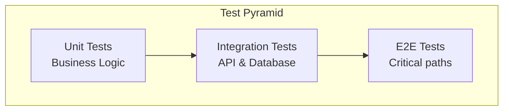

# Testing Guidelines

Testing practices for Pullwise project.

## Overview

Pullwise uses a comprehensive testing strategy:



## Backend Testing (Java)

### Unit Tests with JUnit 5

```java
@ExtendWith(MockitoExtension.class)
class ReviewServiceTest {

    @Mock
    private PluginExecutor pluginExecutor;

    @Mock
    private ReviewRepository reviewRepository;

    @InjectMocks
    private ReviewService reviewService;

    @Test
    @DisplayName("Should create review with valid request")
    void givenValidRequest_whenCreateReview_thenReturnReview() {
        // Given
        CreateReviewRequest request = CreateReviewRequest.builder()
            .projectId(1L)
            .branch("main")
            .commitSha("abc123")
            .build();

        Review expectedReview = Review.builder()
            .id(1L)
            .status(ReviewStatus.PENDING)
            .build();

        when(reviewRepository.save(any(Review.class)))
            .thenReturn(expectedReview);

        // When
        Review result = reviewService.create(request);

        // Then
        assertThat(result).isNotNull();
        assertThat(result.getId()).isEqualTo(1L);
        assertThat(result.getStatus()).isEqualTo(ReviewStatus.PENDING);

        verify(reviewRepository).save(any(Review.class));
    }

    @Test
    @DisplayName("Should throw exception when project not found")
    void givenInvalidProjectId_whenCreateReview_thenThrowException() {
        // Given
        CreateReviewRequest request = CreateReviewRequest.builder()
            .projectId(999L)
            .build();

        when(reviewRepository.findById(999L))
            .thenReturn(Optional.empty());

        // When & Then
        assertThatThrownBy(() -> reviewService.create(request))
            .isInstanceOf(NotFoundException.class)
            .hasMessageContaining("Project not found");
    }
}
```

### Integration Tests with Testcontainers

```java
@SpringBootTest
@Testcontainers
class ReviewIntegrationTest {

    @Container
    static PostgreSQLContainer<?> postgres = new PostgreSQLContainer<>(
        "pgvector/pgvector:pg16"
    )
        .withDatabaseName("pullwise_test")
        .withUsername("pullwise")
        .withPassword("test");

    @Container
    static GenericContainer<?> redis = new GenericContainer<>(
        "redis:7-alpine"
    )
        .withExposedPorts(6379);

    @DynamicPropertySource
    static void configureProperties(DynamicPropertyRegistry registry) {
        registry.add("spring.datasource.url", postgres::getJdbcUrl);
        registry.add("spring.datasource.username", postgres::getUsername);
        registry.add("spring.datasource.password", postgres::getPassword);
        registry.add("spring.redis.host", redis::getHost);
        registry.add("spring.redis.port", () -> redis.getFirstMappedPort());
    }

    @Autowired
    private ReviewRepository reviewRepository;

    @Autowired
    private ReviewService reviewService;

    @Test
    @Transactional
    void shouldCreateAndRetrieveReview() {
        // Given
        CreateReviewRequest request = CreateReviewRequest.builder()
            .projectId(1L)
            .branch("main")
            .commitSha("abc123")
            .build();

        // When
        Review created = reviewService.create(request);
        Optional<Review> found = reviewRepository.findById(created.getId());

        // Then
        assertThat(found).isPresent();
        assertThat(found.get().getStatus()).isEqualTo(ReviewStatus.PENDING);
    }
}
```

### Testing Async Processing

```java
@SpringBootTest
class AsyncReviewProcessingTest {

    @Autowired
    private ReviewService reviewService;

    @Test
    void shouldProcessReviewAsynchronously() throws Exception {
        // Given
        Long reviewId = 1L;

        // When
        reviewService.processAsync(reviewId);

        // Wait for async completion
        await().atMost(30, SECONDS)
            .until(() -> {
                Review review = reviewService.findById(reviewId);
                return review.getStatus() == ReviewStatus.COMPLETED;
            });

        // Then
        Review review = reviewService.findById(reviewId);
        assertThat(review.getStatus()).isEqualTo(ReviewStatus.COMPLETED);
    }
}
```

### Mocking External Services

```java
@ExtendWith(MockitoExtension.class)
class LLMRouterTest {

    @Mock
    private OpenAIClient openAIClient;

    @Mock
    private AnthropicClient anthropicClient;

    @InjectMocks
    private LLMRouter llmRouter;

    @Test
    void shouldRouteToOpenAI() {
        // Given
        LLMRequest request = LLMRequest.builder()
            .provider(LLMProvider.OPENAI)
            .prompt("Review this code")
            .build();

        LLMResponse expectedResponse = LLMResponse.builder()
            .content("Code looks good")
            .build();

        when(openAIClient.chat(any()))
            .thenReturn(expectedResponse);

        // When
        LLMResponse response = llmRouter.route(request);

        // Then
        assertThat(response.getContent()).isEqualTo("Code looks good");
        verify(openAIClient).chat(any());
        verifyNoInteractions(anthropicClient);
    }
}
```

## Frontend Testing (TypeScript)

### Unit Tests with Vitest

```typescript
import { describe, it, expect, vi } from 'vitest';
import { renderHook, act } from '@testing-library/react';
import { useReviews } from '@/hooks/useReviews';

// Mock fetch
global.fetch = vi.fn();

describe('useReviews', () => {
  it('should fetch reviews on mount', async () => {
    // Given
    const mockReviews = [
      { id: 1, status: 'completed' },
      { id: 2, status: 'pending' },
    ];

    vi.mocked(fetch).mockResolvedValueOnce({
      ok: true,
      json: async () => mockReviews,
    } as Response);

    // When
    const { result } = renderHook(() => useReviews({ projectId: 1 }));

    await act(async () => {
      await result.current.fetchReviews();
    });

    // Then
    expect(result.current.reviews).toEqual(mockReviews);
    expect(result.current.loading).toBe(false);
  });

  it('should handle errors', async () => {
    // Given
    vi.mocked(fetch).mockRejectedValueOnce(new Error('Network error'));

    // When
    const { result } = renderHook(() => useReviews({ projectId: 1 }));

    await act(async () => {
      await result.current.fetchReviews();
    });

    // Then
    expect(result.current.error).toBe('Network error');
  });
});
```

### Component Testing with React Testing Library

```typescript
import { render, screen, fireEvent, waitFor } from '@testing-library/react';
import { ReviewList } from './ReviewList';

describe('ReviewList', () => {
  const mockReviews = [
    { id: 1, status: 'completed', issueCount: 5 },
    { id: 2, status: 'pending', issueCount: 0 },
  ];

  it('should render reviews', () => {
    render(<ReviewList reviews={mockReviews} />);

    expect(screen.getByText(/review #1/i)).toBeInTheDocument();
    expect(screen.getByText(/review #2/i)).toBeInTheDocument();
  });

  it('should call onReviewClick when review clicked', () => {
    const handleClick = vi.fn();
    render(<ReviewList reviews={mockReviews} onReviewClick={handleClick} />);

    fireEvent.click(screen.getByText(/review #1/i));

    expect(handleClick).toHaveBeenCalledWith(mockReviews[0]);
  });

  it('should show loading state', () => {
    render(<ReviewList reviews={[]} loading={true} />);

    expect(screen.getByTestId('loading-spinner')).toBeInTheDocument();
  });

  it('should filter by status', async () => {
    render(<ReviewList reviews={mockReviews} />);

    const filterSelect = screen.getByLabelText(/filter by status/i);
    fireEvent.change(filterSelect, { target: { value: 'completed' } });

    await waitFor(() => {
      expect(screen.getByText(/review #1/i)).toBeInTheDocument();
      expect(screen.queryByText(/review #2/i)).not.toBeInTheDocument();
    });
  });
});
```

### API Testing with MSW

```typescript
import { rest } from 'msw';
import { setupServer } from 'msw/node';
import { fetchReviews } from '@/api/reviews';

const server = setupServer(
  rest.get('/api/reviews', (req, res, ctx) => {
    return res(
      ctx.json([
        { id: 1, status: 'completed' },
        { id: 2, status: 'pending' },
      ])
    );
  })
);

beforeAll(() => server.listen());
afterEach(() => server.resetHandlers());
afterAll(() => server.close());

describe('fetchReviews', () => {
  it('should fetch reviews', async () => {
    const reviews = await fetchReviews({ projectId: 1 });

    expect(reviews).toEqual([
      { id: 1, status: 'completed' },
      { id: 2, status: 'pending' },
    ]);
  });

  it('should handle errors', async () => {
    server.use(
      rest.get('/api/reviews', (req, res, ctx) => {
        return res(ctx.status(500));
      })
    );

    await expect(fetchReviews({ projectId: 1 })).rejects.toThrow();
  });
});
```

## E2E Testing with Playwright

```typescript
import { test, expect } from '@playwright/test';

test.describe('Review Flow', () => {
  test('should create and view review', async ({ page }) => {
    // Navigate to project
    await page.goto('/projects/1');
    await expect(page).toHaveURL(/\/projects\/1/);

    // Trigger review
    await page.click('button:has-text("Trigger Review")');

    // Fill form
    await page.fill('input[name="branch"]', 'feature/new-feature');
    await page.fill('input[name="commitSha"]', 'abc123def456');

    // Submit
    await page.click('button:has-text("Start Review")');

    // Wait for completion
    await expect(page.locator('.review-status')).toHaveText('COMPLETED', {
      timeout: 30000,
    });

    // View results
    await page.click('a:has-text("View Results")');
    await expect(page).toHaveURL(/\/reviews\/\d+/);
    await expect(page.locator('.issue-list')).toBeVisible();
  });

  test('should show error on invalid input', async ({ page }) => {
    await page.goto('/projects/1');

    // Trigger review
    await page.click('button:has-text("Trigger Review")');

    // Submit without filling
    await page.click('button:has-text("Start Review")');

    // Expect error
    await expect(page.locator('.error-message')).toHaveText(
      'Branch is required'
    );
  });
});
```

## Test Coverage

### Backend (JaCoCo)

```xml
<!-- pom.xml -->
<plugin>
    <groupId>org.jacoco</groupId>
    <artifactId>jacoco-maven-plugin</artifactId>
    <version>0.8.11</version>
    <executions>
        <execution>
            <goals>
                <goal>prepare-agent</goal>
            </goals>
        </execution>
        <execution>
            <id>report</id>
            <phase>test</phase>
            <goals>
                <goal>report</goal>
            </goals>
        </execution>
        <execution>
            <id>check</id>
            <goals>
                <goal>check</goal>
            </goals>
            <configuration>
                <rules>
                    <rule>
                        <element>PACKAGE</element>
                        <limits>
                            <limit>
                                <counter>LINE</counter>
                                <value>COVEREDRATIO</value>
                                <minimum>0.80</minimum>
                            </limit>
                        </limits>
                    </rule>
                </rules>
            </configuration>
        </execution>
    </executions>
</plugin>
```

### Frontend (Vitest Coverage)

```typescript
// vitest.config.ts
export default defineConfig({
  test: {
    coverage: {
      provider: 'v8',
      reporter: ['text', 'html', 'lcov'],
      statements: 80,
      branches: 80,
      functions: 80,
      lines: 80,
    },
  },
});
```

## Best Practices

### 1. Test Behavior, Not Implementation

```java
// Bad: Testing implementation
@Test
void testMethodCalled() {
    verify(service).save(any());
}

// Good: Testing behavior
@Test
void reviewShouldBeSaved() {
    Review review = service.create(request);
    Review found = repository.findById(review.getId());
    assertThat(found).isPresent();
}
```

### 2. Use Descriptive Test Names

```java
// Given-When-Then pattern
@Test
void givenValidRequest_whenCreateReview_thenReturnReview() { }

@Test
void givenDuplicateId_whenCreateReview_thenThrowException() { }
```

### 3. One Assertion Per Test

```java
// Bad: Multiple assertions
@Test
void testReview() {
    assertThat(review.getId()).isNotNull();
    assertThat(review.getStatus()).isEqualTo(PENDING);
    assertThat(review.getIssues()).isEmpty();
}

// Good: Focused tests
@Test
void reviewShouldHaveId() {
    assertThat(review.getId()).isNotNull();
}

@Test
void reviewShouldStartInPendingStatus() {
    assertThat(review.getStatus()).isEqualTo(PENDING);
}
```

### 4. Use Test Builders

```java
public class ReviewRequestBuilder {
    private Long projectId = 1L;
    private String branch = "main";
    private String commitSha = "abc123";

    public static ReviewRequestBuilder aRequest() {
        return new ReviewRequestBuilder();
    }

    public ReviewRequestBuilder withProjectId(Long id) {
        this.projectId = id;
        return this;
    }

    public ReviewRequestBuilder withBranch(String branch) {
        this.branch = branch;
        return this;
    }

    public CreateReviewRequest build() {
        return CreateReviewRequest.builder()
            .projectId(projectId)
            .branch(branch)
            .commitSha(commitSha)
            .build();
    }
}

// Usage
CreateReviewRequest request = ReviewRequestBuilder
    .aRequest()
    .withProjectId(123L)
    .withBranch("develop")
    .build();
```

### 5. Clean Up Test Data

```java
// Use @Transactional for rollback
@Test
@Transactional
void shouldCreateReview() {
    // Changes rolled back after test
}

// Or clean up explicitly
@Test
void shouldCreateReview() {
    Review review = repository.save(buildReview());
    try {
        // Test
    } finally {
        repository.delete(review);
    }
}
```

## Running Tests

### Backend

```bash
# All tests
./mvnw test

# Specific class
./mvnw test -Dtest=ReviewServiceTest

# Specific method
./mvnw test -Dtest=ReviewServiceTest#givenValidRequest_whenCreateReview_thenReturnReview

# With coverage
./mvnw test jacoco:report

# Integration tests only
./mvnw verify -Pintegration-test
```

### Frontend

```bash
# All tests
npm test

# Watch mode
npm test -- --watch

# Coverage
npm test -- --coverage

# Specific file
npm test -- ReviewList.test.tsx

# UI mode
npm test -- --ui
```

### E2E

```bash
# All E2E tests
npm run test:e2e

# Specific file
npx playwright test review-flow.spec.ts

# headed mode
npx playwright test --headed

# debug mode
npx playwright test --debug
```

## Next Steps

- [Documentation](/docs/developer-guide/contributing/documentation) - Documentation guide
- [Pull Requests](/docs/developer-guide/contributing/pull-requests) - PR guide
- [Workflow](/docs/developer-guide/contributing/workflow) - Git workflow
