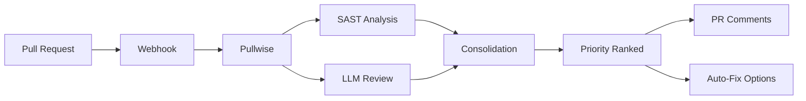

# Introduction to Pullwise

  <h1 style={{ fontSize: '3rem', fontWeight: 700, marginBottom: '1rem', color: 'white' }}>AI-Powered Code Reviews</h1>
  

    The open-source, self-hosted code review platform that combines SAST with LLMs for intelligent, automated reviews.
  

  

    <a href="/docs/getting-started/quick-start" style={{ padding: '0.75rem 1.5rem', background: 'white', color: '#9333ea', borderRadius: '0.5rem', fontWeight: 600, textDecoration: 'none' }}>Get Started →</a>
    <a href="https://github.com/integralltech/pullwise-ai" style={{ padding: '0.75rem 1.5rem', background: 'rgba(255,255,255,0.2)', color: 'white', borderRadius: '0.5rem', fontWeight: 600, textDecoration: 'none', border: '1px solid rgba(255,255,255,0.3)' }}>GitHub</a>
  

**Pullwise** is an open-source, self-hosted AI code review platform that combines static analysis (SAST) with large language models (LLMs) to provide intelligent, automated code reviews.

## The Problem

Code reviews are essential for software quality, but they're:

- **Time-consuming** - Senior developers spend hours reviewing pull requests
- **Inconsistent** - Different reviewers catch different issues
- **Expensive** - Enterprise tools cost thousands per month
- **Vendor lock-in** - Proprietary solutions trap your data

## The Solution

**Pullwise Community Edition (MIT Licensed):**

- **Free forever** - No credit card, no time limits
- **Self-hosted** - Your code never leaves your infrastructure
- **AI-Powered** - Multi-model LLM support (GPT-4, Claude, local models)
- **SAST Integration** - SonarQube, ESLint, Checkstyle, PMD, SpotBugs
- **Auto-Fix** - One-click apply suggestions
- **200+ Plugins** - Community-driven extensions

## How Pullwise Works

### 1. Webhook Integration

Pullwise integrates with your Git provider through webhooks. When a pull request is created or updated, Pullwise automatically triggers a review.

### 2. Multi-Pass Analysis

Pullwise runs multiple analysis passes in parallel:

- **SAST Pass** - Runs static analysis tools (SonarQube, ESLint, etc.)
- **LLM Pass** - Analyzes code with AI models, using SAST results as context
- **Consolidation Pass** - Merges and deduplicates findings
- **Prioritization Pass** - Ranks issues by severity and impact

### 3. Intelligent Results

Pullwise provides:
- **Severity-ranked issues** - Critical, High, Medium, Low
- **Actionable suggestions** - Specific code fixes with explanations
- **Auto-fix support** - One-click apply for many issues
- **False positive marking** - Learn from your team's decisions

## Key Features

### Hybrid SAST + AI Reviews

Pullwise combines the best of both worlds:

1. **Static Analysis** (parallel execution):
   - SonarQube (bugs, vulnerabilities, code smells)
   - ESLint (JavaScript/TypeScript)
   - Checkstyle (Java)
   - PMD (anti-patterns)
   - SpotBugs (bug patterns)

2. **AI Review** (with full context):
   - SAST results as baseline
   - Code graph analysis
   - Historical PR data
   - Custom team instructions

### Multi-Model LLM Router

- **Cloud models**: GPT-4, Claude Sonnet, Gemini Pro via OpenRouter
- **Local models**: Llama 3, Mistral, Gemma via Ollama
- **Cost optimization**: Auto-routes to cheapest model for task
- **Fallback**: Graceful degradation when models fail

### Plugin System

200+ community plugins extending:
- Language linters (Rust, Go, Python, PHP)
- Framework-specific rules (Laravel, Django, Spring)
- Custom checks for your codebase

### Auto-Fix

- One-click apply for AI suggestions
- Safe preview before applying
- Rollback support
- Batch operations

## Editions

Pullwise follows the **GitLab open-core model**:

| Feature | Community Edition | Professional | Enterprise |
|---------|------------------|-------------|------------|
| **Price** | **FREE** | $49/dev/mo | $99/dev/mo |
| **License** | MIT | Proprietary | Proprietary |
| **Users** | 5 | 50 | Unlimited |
| **Organizations** | 1 | 3 | Unlimited |
| **Pipeline** | 2-pass | 4-pass | 4-pass |
| **Code Graph** | ❌ | ✅ | ✅ |
| **SSO/SAML** | ❌ | ✅ | ✅ |

[→ Compare all editions](/docs/category/administration)

## What's Next?

- [Quick Start](/docs/getting-started/quick-start) - Get running in 5 minutes
- [Installation Guide](/docs/category/installation) - Detailed setup options
- [First Review](/docs/getting-started/first-review) - Create your first review
- [Configuration](/docs/getting-started/configuration) - Customize your setup

## Community

Join **10,000+ developers** using Pullwise:

- **5,000+** GitHub Stars
- **10,000+** Docker Pulls
- **200+** Community Plugins
- **1,000+** Discord Members

[→ Join Discord](https://discord.gg/pullwise) | [→ GitHub](https://github.com/integralltech/pullwise-ai)
