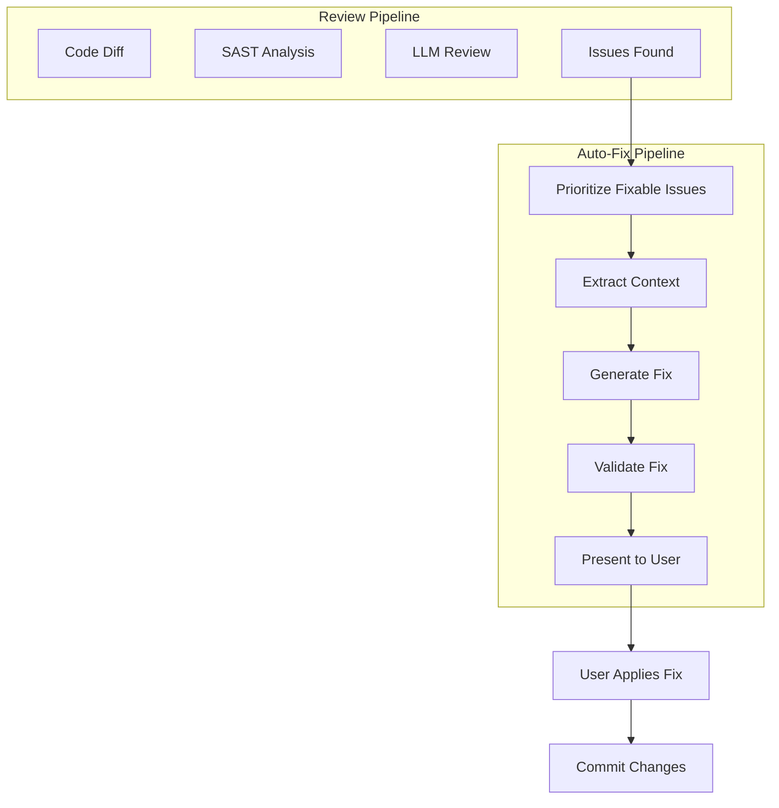
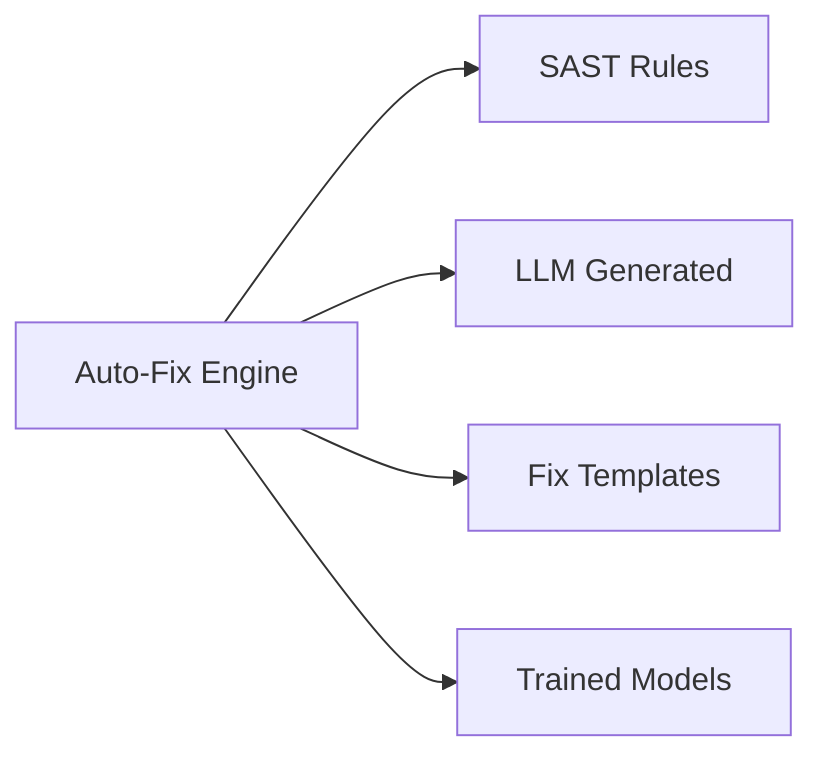

# Auto-Fix Overview

Automatic code fix suggestions powered by AI.

## What is Auto-Fix?

Auto-Fix uses LLMs to generate code fixes for issues found during code review. It analyzes the issue context and suggests actionable code changes.

## How It Works



## Supported Fixes

| Issue Type | Fixable | Example |
|------------|---------|---------|
| **Security** | ✅ | SQL injection → Parameterized query |
| **Bug** | ✅ | Null pointer → Null check |
| **Code Smell** | ✅ | Long method → Extract method |
| **Style** | ✅ | Formatting fixes |
| **Performance** | ⚠️ | Some optimizations |
| **Design** | ❌ | Complex refactoring |

## Fix Sources



### Rule-Based Fixes

```java
// Example: SQL Injection Fix
RuleBasedFix fix = new RuleBasedFix()
    .pattern("Statement\\.execute\\(([^)]+)\\)")
    .replacement("jdbcTemplate.queryForList($1)")
    .explanation("Use parameterized queries to prevent SQL injection");
```

### LLM-Generated Fixes

```java
// Example: AI-generated fix
LLMGeneratedFix fix = new LLMGeneratedFix()
    .prompt("Generate a fix for this code smell")
    .context(codeSnippet)
    .constraints("Keep existing logic, add null checks")
    .generate();
```

## Fix Confidence Levels

| Level | Description | Action |
|-------|-------------|--------|
| **High** | Fix is tested and proven | One-click apply |
| **Medium** | Fix likely correct | Review before apply |
| **Low** | Fix may need adjustment | Manual editing required |

## Configuration

```yaml
# application.yml
pullwise:
  autofix:
    enabled: true
    maxFixesPerReview: 10
    requireApproval: true
    confidenceThreshold: MEDIUM
    timeout: 30000
    llm:
      provider: openai
      model: gpt-4
      temperature: 0.2
```

## Example Fix

### Before

```java
public User getUserById(String userId) {
    String query = "SELECT * FROM users WHERE id = '" + userId + "'";
    return statement.execute(query);
}
```

### Issue

```
[VULNERABILITY] SQL_INJECTION at UserService.java:42
String concatenation in SQL query allows injection.
```

### After Auto-Fix

```java
public User getUserById(String userId) {
    String query = "SELECT * FROM users WHERE id = ?";
    return jdbcTemplate.queryForObject(
        query,
        User.class,
        userId
    );
}
```

## Best Practices

### 1. Review Before Applying

Always review the generated fix before applying:

- Verify logic is preserved
- Check for new issues
- Run tests after applying

### 2. Apply Incrementally

Apply fixes one at a time rather than all at once:

```bash
# Apply single fix
pullwise apply-fix --issue-id=123

# Apply all fixes (risky)
pullwise apply-fix --all
```

### 3. Keep Context

Auto-Fix needs context to generate good fixes:

- Include surrounding code
- Preserve imports
- Maintain formatting style

### 4. Test After Apply

Always run tests after applying fixes:

```bash
# Auto-fix workflow
pullwise review
pullwise apply-fix --issue-id=123
mvn test  # or npm test
git commit -m "fix: apply auto-fix for issue 123"
```

## Limitations

### Not Fixable

- **Architectural issues** - Require design changes
- **Performance issues** - May need profiling
- **Complex refactoring** - Beyond simple fixes
- **Test failures** - Need human investigation

### Requires Human Review

- **Business logic changes** - Understand requirements
- **API changes** - Verify compatibility
- **Database migrations** - Plan carefully

## Next Steps

- [Applying Fixes](/docs/user-guide/autofix/applying-fixes) - How to apply fixes
- [Rollback](/docs/user-guide/autofix/rollback) - Reverting fixes
- [Reviews](/docs/user-guide/reviews/understanding-results) - Understanding reviews
