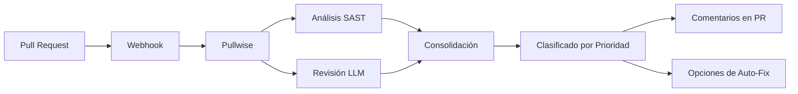

# Introducción a Pullwise

**Pullwise** es una plataforma de revisión de código con IA, de código abierto y autoalojada que combina análisis estático (SAST) con grandes modelos de lenguaje (LLMs) para proporcionar revisiones de código inteligentes y automatizadas.

## El Problema

Las revisiones de código son esenciales para la calidad del software, pero son:

- **Lentas** - Los desarrolladores senior pasan horas revisando pull requests
- **Inconsistentes** - Diferentes revisores detectan diferentes problemas
- **Costosas** - Las herramientas empresariales cuestan miles al mes
- **Vendor lock-in** - Las soluciones propietarias atrapan tus datos

## La Solución

**Pullwise Community Edition (Licenciado MIT):**

- **Gratis para siempre** - Sin tarjeta de crédito, sin límites de tiempo
- **Autoalojado** - Tu código nunca sale de tu infraestructura
- **Potenciado por IA** - Soporte multi-modelo LLM (GPT-4, Claude, modelos locales)
- **Integración SAST** - SonarQube, ESLint, Checkstyle, PMD, SpotBugs
- **Auto-Fix** - Aplicar sugerencias con un clic
- **200+ Plugins** - Extensiones de la comunidad

## Cómo Funciona Pullwise

### 1. Integración via Webhook

Pullwise se integra con tu proveedor Git a través de webhooks. Cuando se crea o actualiza un pull request, Pullwise activa automáticamente una revisión.

### 2. Análisis Multi-Pass

Pullwise ejecuta múltiples pasadas de análisis en paralelo:

- **Pasada SAST** - Ejecuta herramientas de análisis estático (SonarQube, ESLint, etc.)
- **Pasada LLM** - Analiza código con modelos de IA, usando resultados SAST como contexto
- **Pasada de Consolidación** - Fusiona y deduplica hallazgos
- **Pasada de Priorización** - Clasifica problemas por severidad e impacto

### 3. Resultados Inteligentes

Pullwise proporciona:
- **Problemas clasificados por severidad** - Crítica, Alta, Media, Baja
- **Sugerencias accionables** - Correcciones específicas de código con explicaciones
- **Soporte auto-fix** - Aplicar con un clic en muchos problemas
- **Marcado de falso positivo** - Aprende de las decisiones de tu equipo

## Características Principales

### Revisiones Híbridas SAST + IA

Pullwise combina lo mejor de ambos mundos:

1. **Análisis Estático** (ejecución paralela):
   - SonarQube (bugs, vulnerabilidades, code smells)
   - ESLint (JavaScript/TypeScript)
   - Checkstyle (Java)
   - PMD (anti-patrones)
   - SpotBugs (patrones de bug)

2. **Revisión con IA** (con contexto completo):
   - Resultados SAST como línea base
   - Análisis de grafo de código
   - Datos históricos de PRs
   - Instrucciones personalizadas del equipo

### Enrutador Multi-Modelo LLM

- **Modelos cloud**: GPT-4, Claude Sonnet, Gemini Pro vía OpenRouter
- **Modelos locales**: Llama 3, Mistral, Gemma vía Ollama
- **Optimización de costo**: Enruta automáticamente al modelo más barato
- **Fallback**: Degradación elegante cuando los modelos fallan

### Sistema de Plugins

200+ plugins de la comunidad extendiendo:
- Linters de lenguaje (Rust, Go, Python, PHP)
- Reglas específicas de framework (Laravel, Django, Spring)
- Verificaciones personalizadas para tu codebase

### Auto-Fix

- Aplicar con un clic sugerencias de la IA
- Vista previa segura antes de aplicar
- Soporte de rollback
- Operaciones por lotes

## Ediciones

Pullwise sigue el **modelo open-core de GitLab**:

| Característica | Community Edition | Professional | Enterprise |
|----------------|------------------|-------------|------------|
| **Precio** | **GRATIS** | $49/dev/mes | $99/dev/mes |
| **Licencia** | MIT | Propietaria | Propietaria |
| **Usuarios** | 5 | 50 | Ilimitado |
| **Organizaciones** | 1 | 3 | Ilimitadas |
| **Pipeline** | 2-pass | 4-pass | 4-pass |
| **Code Graph** | ❌ | ✅ | ✅ |
| **SSO/SAML** | ❌ | ✅ | ✅ |

[→ Compara todas las ediciones](/docs/category/administration)

## Qué Sigue

- [Quick Start](/docs/getting-started/quick-start) - Comienza en 5 minutos
- [Guía de Instalación](/docs/category/installation) - Opciones detalladas de configuración
- [Primera Revisión](/docs/getting-started/first-review) - Crea tu primera revisión
- [Configuración](/docs/getting-started/configuration) - Personaliza tu instalación

## Comunidad

Únete a **10.000+ desarrolladores** usando Pullwise:

- **5.000+** Estrellas en GitHub
- **10.000+** Docker Pulls
- **200+** Plugins de la Comunidad
- **1.000+** Miembros en Discord

[→ Únete al Discord](https://discord.gg/pullwise) | [→ GitHub](https://github.com/integralltech/pullwise-ai)
