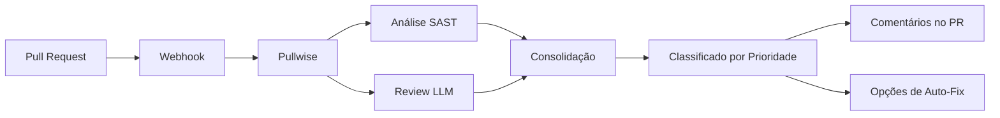

# Introdução ao Pullwise

**Pullwise** é uma plataforma de code review com IA, open-source e self-hosted que combina análise estática (SAST) com grandes modelos de linguagem (LLMs) para fornecer reviews de código inteligentes e automatizados.

## O Problema

Code reviews são essenciais para a qualidade do software, mas são:

- **Demorados** - Desenvolvedores seniors gastam horas revisando pull requests
- **Inconsistentes** - Revisores diferentes captam problemas diferentes
- **Caros** - Ferramentas enterprise custam milhares por mês
- **Vendor lock-in** - Soluções proprietárias prendem seus dados

## A Solução

**Pullwise Community Edition (Licenciado MIT):**

- **Grátis para sempre** - Sem cartão de crédito, sem limites de tempo
- **Self-hosted** - Seu código nunca sai da sua infraestrutura
- **Powered por IA** - Suporte multi-modelo LLM (GPT-4, Claude, modelos locais)
- **Integração SAST** - SonarQube, ESLint, Checkstyle, PMD, SpotBugs
- **Auto-Fix** - Aplicar sugestões com um clique
- **200+ Plugins** - Extensões da comunidade

## Como o Pullwise Funciona

### 1. Integração via Webhook

Pullwise integra com seu provedor Git através de webhooks. Quando um pull request é criado ou atualizado, o Pullwise automaticamente aciona um review.

### 2. Análise Multi-Pass

Pullwise executa múltiplas passadas de análise em paralelo:

- **Passada SAST** - Executa ferramentas de análise estática (SonarQube, ESLint, etc.)
- **Passada LLM** - Analisa código com modelos de IA, usando resultados SAST como contexto
- **Passada de Consolidação** - Mescla e deduplica achados
- **Passada de Priorização** - Classifica issues por severidade e impacto

### 3. Resultados Inteligentes

Pullwise fornece:
- **Issues classificadas por severidade** - Crítica, Alta, Média, Baixa
- **Sugestões acionáveis** - Correções específicas de código com explicações
- **Suporte auto-fix** - Aplicar com um clique em muitas issues
- **Marcação de falso positivo** - Aprende com decisões da sua equipe

## Recursos Principais

### Reviews Híbridos SAST + IA

Pullwise combina o melhor dos dois mundos:

1. **Análise Estática** (execução paralela):
   - SonarQube (bugs, vulnerabilidades, code smells)
   - ESLint (JavaScript/TypeScript)
   - Checkstyle (Java)
   - PMD (anti-patterns)
   - SpotBugs (padrões de bug)

2. **Review com IA** (com contexto completo):
   - Resultados SAST como linha de base
   - Análise de grafo de código
   - Dados históricos de PRs
   - Instruções customizadas da equipe

### Roteador Multi-Modelo LLM

- **Modelos cloud**: GPT-4, Claude Sonnet, Gemini Pro via OpenRouter
- **Modelos locais**: Llama 3, Mistral, Gemma via Ollama
- **Otimização de custo**: Roteia automaticamente para o modelo mais barato
- **Fallback**: Degradação grácil quando modelos falham

### Sistema de Plugins

200+ plugins da comunidade estendendo:
- Linters de linguagem (Rust, Go, Python, PHP)
- Regras específicas de framework (Laravel, Django, Spring)
- Verificações customizadas para seu codebase

### Auto-Fix

- Aplicar com um clique sugestões da IA
- Preview seguro antes de aplicar
- Suporte a rollback
- Operações em lote

## Edições

Pullwise segue o **modelo open-core do GitLab**:

| Recurso | Community Edition | Professional | Enterprise |
|---------|------------------|-------------|------------|
| **Preço** | **GRÁTIS** | $49/dev/mês | $99/dev/mês |
| **Licença** | MIT | Proprietária | Proprietária |
| **Usuários** | 5 | 50 | Ilimitado |
| **Organizações** | 1 | 3 | Ilimitadas |
| **Pipeline** | 2-pass | 4-pass | 4-pass |
| **Code Graph** | ❌ | ✅ | ✅ |
| **SSO/SAML** | ❌ | ✅ | ✅ |

[→ Compare todas as edições](/docs/category/administration)

## O Que Vem Depois?

- [Quick Start](/docs/getting-started/quick-start) - Comece em 5 minutos
- [Guia de Instalação](/docs/category/installation) - Opções detalhadas de setup
- [Primeiro Review](/docs/getting-started/first-review) - Crie seu primeiro review
- [Configuração](/docs/getting-started/configuration) - Personalize sua instalação

## Comunidade

Junte-se a **10.000+ desenvolvedores** usando Pullwise:

- **5.000+** Estrelas no GitHub
- **10.000+** Docker Pulls
- **200+** Plugins da Comunidade
- **1.000+** Membros no Discord

[→ Entre no Discord](https://discord.gg/pullwise) | [→ GitHub](https://github.com/integralltech/pullwise-ai)
