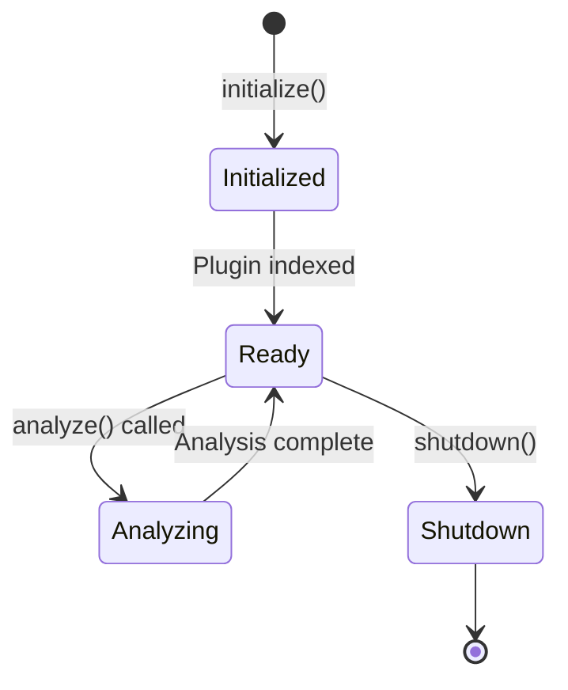

# Plugin Development Overview

Learn how to create custom plugins for Pullwise.

## What are Plugins?

Plugins extend Pullwise's code analysis capabilities. They can:

- **Add language support** - Analyze new programming languages
- **Integrate tools** - Wrap external linters and analyzers
- **Custom rules** - Enforce project-specific standards
- **Bug detection** - Find patterns specific to your codebase

## Plugin Architecture

### Plugin Interface

All plugins implement the `CodeReviewPlugin` interface:

```java
public interface CodeReviewPlugin {
    // Identification
    String getId();
    String getName();
    String getVersion();
    String getAuthor();

    // Capabilities
    PluginType getType();
    Set<PluginLanguage> getSupportedLanguages();

    // Lifecycle
    void initialize(PluginContext context);
    AnalysisResult analyze(AnalysisRequest request);
    void shutdown();
}
```

### Plugin Types

| Type | Description | Examples |
|------|-------------|----------|
| **SAST** | Static application security testing | Security scanners |
| **LINTER** | Code style and quality | ESLint, Checkstyle |
| **SECURITY** | Vulnerability detection | Bandit, Brakeman |
| **PERFORMANCE** | Performance analysis | Performance profilers |
| **CUSTOM_LLM** | Custom LLM integration | Fine-tuned models |

### Supported Languages

```java
public enum PluginLanguage {
    JAVA, JAVASCRIPT, TYPESCRIPT, PYTHON, GO, RUST,
    PHP, CSHARP, KOTLIN, RUBY, SWIFT, ALL
}
```

## Plugin Discovery

Pullwise discovers plugins through:

### 1. Java SPI (Service Provider Interface)

Create a file at:
```
META-INF/services/com.pullwise.api.application.service.plugin.api.CodeReviewPlugin
```

Content:
```
com.example.MyCustomPlugin
com.example.AnotherPlugin
```

### 2. External Plugin Directory

Place JAR files in:
```
/opt/pullwise/plugins/
├── my-plugin.jar
├── another-plugin.jar
└── config/
    └── my-plugin.yml
```

## Plugin Lifecycle



### Initialize Phase

```java
@Override
public void initialize(PluginContext context) {
    // Read configuration
    boolean enabled = context.getConfiguration()
        .getBoolean("enabled", true);

    // Setup resources
    this.executor = createExecutor();

    // Validate environment
    if (!checkRequirements()) {
        throw new PluginException("Requirements not met");
    }
}
```

### Analyze Phase

```java
@Override
public AnalysisResult analyze(AnalysisRequest request) {
    List<Issue> issues = new ArrayList<>();

    // Parse diff
    List<DiffFile> files = request.getDiff().getFiles();

    // Analyze each file
    for (DiffFile file : files) {
        if (!supportsLanguage(file.getLanguage())) {
            continue;
        }
        issues.addAll(analyzeFile(file));
    }

    return AnalysisResult.builder()
        .pluginId(getId())
        .issues(issues)
        .success(true)
        .build();
}
```

## Configuration

Plugins can be configured via:

### 1. Global Configuration

```yaml
# application.yml
pullwise:
  plugins:
    my-plugin:
      enabled: true
      config:
        max-issues: 100
        severity: HIGH
```

### 2. Project Configuration

```yaml
# Project settings
plugins:
  my-plugin:
    enabled: true
    config:
      rules:
        - no-todo
        - no-console-log
```

### Access Configuration

```java
protected void doInitialize() throws PluginException {
    // Read boolean
    boolean enabled = getConfigBoolean("enabled", true);

    // Read integer
    int maxIssues = getConfigInt("max-issues", 100);

    // Read string
    String severity = getConfigString("severity", "MEDIUM");

    // Read list
    List<String> rules = getConfigList("rules", Collections.emptyList());
}
```

## Abstract Base Class

Use `AbstractCodeReviewPlugin` for easier plugin development:

```java
public class MyPlugin extends AbstractCodeReviewPlugin {

    @Override
    protected void doInitialize() throws PluginException {
        // Custom initialization
    }

    @Override
    protected AnalysisResult doAnalyze(AnalysisRequest request) {
        // Analysis logic
    }

    // Required methods
    @Override
    public String getId() {
        return "com.example.my-plugin";
    }

    @Override
    public String getName() {
        return "My Plugin";
    }

    @Override
    public PluginType getType() {
        return PluginType.LINTER;
    }

    @Override
    public Set<PluginLanguage> getSupportedLanguages() {
        return Set.of(PluginLanguage.JAVA, PluginLanguage.TYPESCRIPT);
    }
}
```

## Plugin Data

### AnalysisRequest

```java
public class AnalysisRequest {
    private String reviewId;
    private String projectId;
    private Diff diff;              // Code changes
    private String branch;
    private String commitSha;
    private Map<String, Object> context;  // Additional data
}
```

### AnalysisResult

```java
public class AnalysisResult {
    private String pluginId;
    private List<Issue> issues;
    private Map<String, Object> metadata;
    private Duration executionTime;
    private boolean success;
    private String errorMessage;
}
```

### Issue

```java
public class Issue {
    private Severity severity;       // CRITICAL, HIGH, MEDIUM, LOW
    private IssueType type;          // BUG, VULNERABILITY, CODE_SMELL
    private String rule;
    private String filePath;
    private Integer startLine;
    private Integer endLine;
    private String message;
    private String suggestion;
    private Map<String, Object> metadata;
}
```

## Best Practices

### 1. Fast Execution

```java
// Use timeout protection
@Override
public AnalysisResult analyze(AnalysisRequest request) {
    long deadline = System.currentTimeMillis() + getTimeout();
    // ... analysis with deadline checks
}
```

### 2. Error Handling

```java
try {
    return analyzeCode(request);
} catch (Exception e) {
    log.error("Analysis failed", e);
    return AnalysisResult.builder()
        .pluginId(getId())
        .success(false)
        .errorMessage(e.getMessage())
        .build();
}
```

### 3. Resource Cleanup

```java
@Override
public void shutdown() {
    if (executor != null) {
        executor.shutdownNow();
    }
    if (connection != null) {
        connection.close();
    }
}
```

### 4. Logging

```java
private static final Logger log =
    LoggerFactory.getLogger(MyPlugin.class);

@Override
public AnalysisResult analyze(AnalysisRequest request) {
    log.info("Starting analysis for review {}", request.getReviewId());
    // ... analysis
    log.debug("Found {} issues", issues.size());
    return result;
}
```

## Testing Plugins

### Unit Tests

```java
@Test
void shouldDetectIssue() {
    MyPlugin plugin = new MyPlugin();
    plugin.initialize(mockContext);

    AnalysisRequest request = AnalysisRequest.builder()
        .diff(testDiff)
        .build();

    AnalysisResult result = plugin.analyze(request);

    assertThat(result.getIssues()).hasSize(1);
    assertThat(result.getIssues().get(0).getMessage())
        .contains("TODO comment");
}
```

### Integration Tests

```java
@SpringBootTest
class PluginIntegrationTest {
    @Autowired
    private PluginManager pluginManager;

    @Test
    void shouldLoadPlugin() {
        Optional<CodeReviewPlugin> plugin =
            pluginManager.getPlugin("com.example.my-plugin");

        assertThat(plugin).isPresent();
    }
}
```

## Next Steps

- [Getting Started](/docs/plugin-development/getting-started) - Create your first plugin
- [Plugin Types](/docs/plugin-development/plugin-types/) - Explore plugin types
- [API Reference](/docs/plugin-development/api-reference/) - Complete API docs
- [Examples](/docs/plugin-development/examples/) - Example plugins
