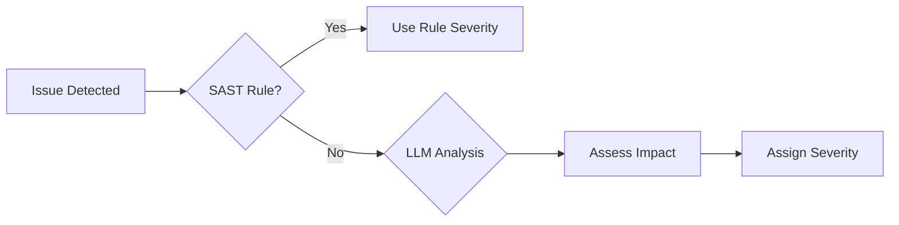

# Severity Levels

Understanding and configuring severity levels in Pullwise.

## Overview

Pullwise classifies issues into four severity levels:

| Severity | Color | Icon | Block Merge | Fix Timeframe |
|----------|-------|------|-------------|---------------|
| **Critical** | Red | 🔴 | Yes (default) | Immediate |
| **High** | Orange | 🟠 | Optional | Within 24h |
| **Medium** | Yellow | 🟡 | No | Within 1 week |
| **Low** | Blue | 🔵 | No | When possible |

## Critical Severity

### Definition

Issues that represent:

- **Security vulnerabilities** that could be exploited
- **Data loss** potential
- **System crashes** in production
- **Compliance violations**

### Examples

| Type | Rule | Example |
|------|------|---------|
| SQL Injection | `SONARSECURITY:SQL_INJECTION` | `query = "SELECT * WHERE id = " + input` |
| Hardcoded Secret | `HARDCODED_PASSWORD` | `password = "secret123"` |
| Command Injection | `COMMAND_INJECTION` | `exec(userInput)` |
| Path Traversal | `PATH_TRAVERSAL` | `file = new File("../" + path)` |
| XXE | `XXE_VULNERABILITY` | `XMLReader with external entities` |

### Default Behavior

```yaml
thresholds:
  block_on_critical: true  # Block PR merge
  require_approval: true    # Require manual approval
  auto_create_issue: true   # Create tracker issue
```

## High Severity

### Definition

Issues that:

- Cause runtime errors
- Lead to incorrect behavior
- Impact performance significantly
- Cause resource leaks

### Examples

| Type | Rule | Example |
|------|------|---------|
| Null Pointer | `NullPointerException` | `user.getName().toString()` |
| Resource Leak | `RESOURCE_LEAK` | File stream not closed |
| Race Condition | `RACE_CONDITION` | Non-atomic counter |
| Index Error | `INDEX_OUT_OF_BOUNDS` | Array access without check |

### Default Behavior

```yaml
thresholds:
  block_on_high: false  # Don't block by default
  notify: true          # Send notification
  suggest_fix: true     # Show auto-fix if available
```

## Medium Severity

### Definition

Issues affecting:

- Code maintainability
- Performance (non-critical)
- Error handling
- Code duplication

### Examples

| Type | Rule | Example |
|------|------|---------|
| Long Method | `LONG_METHOD` | Method > 50 lines |
| High Complexity | `HIGH_CYCLOMATIC` | Complexity > 10 |
| Duplicate Code | `DUPLICATE_CODE` | Same logic in 3+ places |
| Missing Docs | `MISSING_JAVADOC` | Public method without docs |

### Default Behavior

```yaml
thresholds:
  block_on_medium: false
  create_tech_debt: true  # Create tech debt ticket
  batch: true             # Batch similar issues
```

## Low Severity

### Definition

Minor issues:

- Code style violations
- Naming convention issues
- Formatting problems
- Minor optimizations

### Examples

| Type | Rule | Example |
|------|------|---------|
| Line Length | `LINE_TOO_LONG` | Line > 120 characters |
| Naming | `INVALID_IDENTIFIER` | Variable doesn't match convention |
| Import Order | *WRONG_IMPORT_ORDER* | Imports not sorted |
| Unused Variable | `UNUSED_VARIABLE` | Variable assigned but not read |

### Default Behavior

```yaml
thresholds:
  block_on_low: false
  auto_fix: true          # Auto-fix when possible
  batch_fix: true         # Apply all low-severity fixes
```

## Severity Assignment

### How Pullwise Assigns Severity



### SAST Rule Severity

Static analysis tools provide severity:

```java
@Rule(key = "SQL_INJECTION",
      severity = Severity.CRITICAL,
      name = "SQL queries should not be vulnerable")
public class SqlInjectionRule extends BaseRule {
    // Rule implementation
}
```

### LLM Severity Assessment

LLM considers:

1. **Exploitability** - How easy to exploit
2. **Impact** - Damage if exploited
3. **Scope** - How many affected
4. **Likelihood** - Probability of occurrence

```python
# LLM severity logic
if exploitability == HIGH and impact == HIGH:
    severity = CRITICAL
elif exploitability == MEDIUM or impact == MEDIUM:
    severity = HIGH
elif impact == LOW:
    severity = MEDIUM
else:
    severity = LOW
```

## Custom Severity

### Per-Rule Severity

Override default severity:

```yaml
# application.yml
pullwise:
  severity:
    overrides:
      # Make specific rule more severe
      SONARSECURITY:SQL_INJECTION: CRITICAL

      # Make less severe
      UNUSED_IMPORT: LOW

      # Promote by level
      CODE_SMELL: +1  # MEDIUM → HIGH
      STYLE: -1       # LOW → IGNORED
```

### Per-File Severity

Different severity for different paths:

```yaml
file_severity:
  # Authentication code - stricter
  "src/main/java/auth/**":
    base_severity: HIGH
    promote:
      CODE_SMELL: HIGH

  # Test files - more lenient
  "src/test/**":
    base_severity: LOW
    demote:
      HIGH: MEDIUM
      MEDIUM: LOW
```

### Per-Language Severity

```yaml
language_severity:
  typescript:
    unused_variable: LOW
    no_console: MEDIUM

  python:
    unused_import: LOW
    print_statement: LOW

  java:
    all: 0  # +1 to default severity
```

## Severity Thresholds

### Configure Blocking

```yaml
# Block PR merge based on severity
thresholds:
  block_on_critical: true
  block_on_high: false
  block_on_medium: false
  block_on_low: false

  # Block if count exceeds threshold
  block_if:
    critical: 0      # Any critical blocks
    high: 5          # 5+ high blocks
    total: 20        # 20+ total issues blocks
```

### Require Approval

```yaml
# Require manual approval for certain severities
approval_required:
  critical: true  # Always require approval
  high: true      # Require approval if > 3
  medium: false
  low: false
```

## Severity Metrics

### Track by Severity

```yaml
# Dashboard metrics
severity_metrics:
  - total_by_severity
  - trend_by_severity
  - false_positive_rate_by_severity
  - time_to_fix_by_severity
```

### Target Levels

Set quality goals:

```yaml
goals:
  critical_issues: 0
  high_issues: <5 per PR
  medium_issues: <20 per PR
  low_issues: <50 per PR
```

## Best Practices

### 1. Start Conservative

```yaml
# Begin with stricter thresholds
block_on_critical: true
block_on_high: true
block_on_medium: true
```

### 2. Adjust Based on Feedback

```yaml
# Loosen as team adapts
block_on_high: false
block_on_medium: false
```

### 3. Document Decisions

```yaml
# Document why severity was assigned
severity:
  SQL_INJECTION:
    level: CRITICAL
    reason: "Can lead to data breach"
    reference: "CWE-89"
```

## Next Steps

- [Understanding Results](/docs/user-guide/reviews/understanding-results) - Interpret results
- [False Positives](/docs/user-guide/reviews/false-positives) - Handle false positives
- [Configuration](/docs/getting-started/configuration) - Customize settings
